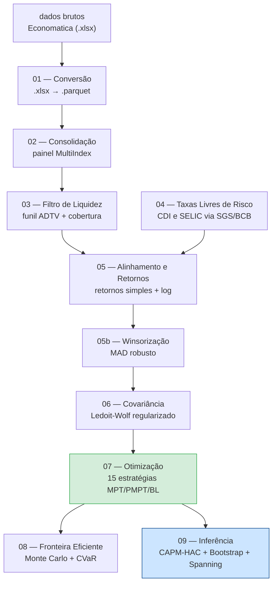

# Relatório Técnico — Sistema de Otimização de Portfólios no Mercado Brasileiro

**Título do TCC:** Moderna Teoria das Carteiras no Mercado de Ações Brasileiro: Comparação entre Otimizadores e Inputs  
**Autor:** Pedro Augusto Pinheiro Reis  
**Instituição:** Universidade Federal de Goiás (UFG) — Faculdade de Administração, Ciências Contábeis e Ciências Econômicas (FACE)  
**Orientador:** Prof. Dr. Moisés Ferreira da Cunha  
**Data:** Junho de 2026

---

## 1. Visão Geral

Este projeto implementa um sistema computacional de ponta a ponta para construção, avaliação e comparação de carteiras de investimento otimizadas no mercado de ações brasileiro (B3). O problema central abordado é a seguinte questão empírica: estratégias de otimização quantitativa baseadas na Teoria Moderna das Carteiras (MPT), nas extensões de Post-Modern Portfolio Theory (PMPT) e no modelo de Black-Litterman conseguem superar, de forma estatisticamente significativa, uma estratégia ingênua de ponderação igualitária (1/N) e o índice de referência IBOVESPA no mercado brasileiro, após custos de transação?

O sistema responde a essa pergunta construindo um pipeline reprodutível de nove etapas — desde a ingestão e sanitização dos dados brutos da Economatica até a inferência estatística dos resultados —, que implementa ao todo quinze estratégias de alocação distintas (seis de média-variância, cinco de *downside risk* e quatro variantes de Black-Litterman com visões geradas por momentum). Todo o processamento respeita rigorosamente a cronologia da informação, utilizando janelas expansivas para eliminar *look-ahead bias*, e os resultados são avaliados no período *out-of-sample* de janeiro de 2015 a dezembro de 2025 sobre uma amostra de 118 ativos da B3 com cobertura temporal superior a 95%.

---

## 2. Arquitetura

O sistema é organizado em três camadas funcionais que se comunicam exclusivamente por meio de artefatos em disco (arquivos `.parquet` e `.csv`), garantindo isolamento entre etapas e reprodutibilidade total.

**Camada de Orquestração** — O script `src/run_pipeline.py` atua como maestro: executa os notebooks em ordem topológica, verifica a presença dos arquivos-sentinela de saída de cada etapa e calcula hashes MD5 do código-fonte para decidir se uma etapa precisa ser reexecutada ou pode ser pulada (*smart cache*). Ao final, chama `src/test_pipeline.py` para validar a integridade dos artefatos gerados.

**Camada de Notebooks** — Cada uma das nove etapas possui um Jupyter Notebook numerado que orquestra a lógica de negócio da etapa, imprime diagnósticos e persiste os resultados. Os notebooks são intencionalmente delgados: toda função não trivial é extraída para módulos Python locais em `utils/`, permitindo reuso e testabilidade.

**Camada de Módulos Utilitários** — Cada etapa possui uma pasta `utils/` com módulos `.py` especializados. O módulo `config_loader.py`, replicado em cada etapa, localiza e carrega o arquivo de configuração central `src/config.json`, garantindo que todos os parâmetros metodológicos — janela de aquecimento, custo de transação, teto por ativo, nível de significância — sejam definidos em um único lugar.

O diagrama a seguir ilustra o fluxo de dependências entre as etapas:



---

## 3. Stack Tecnológica

O sistema é implementado integralmente em **Python 3.11**, escolha motivada pela compatibilidade com TensorFlow/Keras (não suporta completamente Python 3.12+) e pela maturidade do ecossistema científico disponível nessa versão.

| Biblioteca | Versão mínima | Papel no sistema | Justificativa da escolha |
|---|---|---|---|
| `pandas` | 2.0 | Manipulação de séries temporais e painéis de dados | Padrão de facto para dados tabulares em Python; suporte nativo a índices de data e resampling |
| `numpy` | 1.24 | Álgebra linear vetorizada, cálculo de hashes, operações matriciais | Desempenho via BLAS/LAPACK; base de todas as outras bibliotecas |
| `scipy` | 1.10 | Otimização não-linear (SLSQP), testes estatísticos | `scipy.optimize.minimize` é o solver para carteiras MPT/PMPT; `scipy.stats` para distribuições |
| `cvxpy` | — | Programação convexa (CVaR, CDaR) | Linguagem declarativa para problemas de otimização; suporte a múltiplos solvers (CLARABEL, ECOS, SCS) |
| `statsmodels` | 0.14 | Regressão OLS com erros HAC, ADF, KPSS, Ljung-Box, ARCH-LM | Implementações auditadas de econometria clássica; erros de Newey-West robustos |
| `arch` | 6.0 | Modelos GARCH/GJR-GARCH/EGARCH, bootstrap estacionário, razão de variâncias | Referência em modelagem de volatilidade condicional para Python; `StationaryBootstrap` de Politis & Romano (1994) |
| `scikit-learn` | — | Referência para validação do Ledoit-Wolf (opcional) | Implementação de referência para verificar paridade da estimativa customizada |
| `matplotlib` / `seaborn` | 3.7 | Gráficos de curvas de capital, fronteiras eficientes, diagnósticos | Controle fino sobre formatação para publicação acadêmica |
| `jupyterlab` | 4.0 | Interface de execução dos notebooks | Permite reprodução célula a célula com inspeção de outputs intermediários |
| `pyarrow` | 12.0 | Engine de leitura/escrita de arquivos `.parquet` | Formato colunar comprimido; leitura ~10× mais rápida que CSV para dados numéricos grandes |

Os solvers de otimização convexa são ativados na ordem `CLARABEL → ECOS → SCS`, com fallback automático. `CLARABEL` é o solver padrão do CVXPY moderno, mais estável que ECOS para problemas mal-condicionados; `SCS` é o fallback de último recurso por ser menos preciso.

---

## 4. Estrutura de Diretórios

```
1_TCC_Final/
│
├── CLAUDE.md                   # Instruções e estado do projeto para o agente de IA
├── RELATORIO_TECNICO.md        # Este documento
├── README.md                   # Visão geral pública do repositório
├── requirements.txt            # Dependências com versões mínimas
│
├── data/                       # Todos os artefatos de dados (não versionados)
│   ├── dados_economatica_tratados/   # Saída do NB01 — parquets por ativo
│   ├── dados_economatica_consolidados/  # Saída do NB02 — painel MultiIndex
│   ├── Matriz_Precos/          # Saída do NB03 — matriz de preços filtrada
│   ├── CDI/ e Selic/           # Saída do NB04 — taxas diárias do BCB
│   ├── Retornos/               # Saída do NB05 — retornos simples e log, saneados
│   ├── Momentos/               # Saída do NB06 — mu, Sigma amostral, Sigma LW, correlação
│   ├── Estrategias/            # Saída do NB07-09 — retornos, pesos, métricas, apêndices
│   └── Tickers/                # Lista de ativos investíveis após filtro de liquidez
│
└── src/                        # Todo o código-fonte
    ├── config.json             # Parâmetros centralizados (única fonte de verdade)
    ├── run_pipeline.py         # Orquestrador com cache MD5 inteligente
    ├── test_pipeline.py        # Suíte de 9 testes de integridade pós-execução
    │
    ├── 01_Conversao_Parquet/
    │   ├── 01_01_convertendo_em_parquet_v3.ipynb  # Notebook ativo
    │   └── worker.py           # Lógica de conversão .xlsx → .parquet por ativo
    │
    ├── 02_Consolidacao_Dados/
    │   └── 02_01_consolidando_dados.ipynb
    │
    ├── 03_Filtro_Liquidez/
    │   ├── 03_01_Ingestao_Filtro_Liquidez_v3.ipynb
    │   └── utils/
    │       ├── filtros.py      # Funil ADTV, limiar de presença (≥95%), exclusão
    │       ├── auditoria.py    # Log de ativos removidos por critério
    │       └── config_loader.py
    │
    ├── 04_Taxas_Livres_Risco/
    │   ├── 04_01_Taxas_Livres_Risco_SGS_Final.ipynb
    │   └── utils/
    │       ├── sgs_api.py      # Cliente HTTP para API do SGS/Banco Central
    │       ├── econometria.py  # Testes ADF/KPSS nas séries de taxa
    │       └── conversoes.py   # Conversão de taxas diárias ↔ anuais
    │
    ├── 05_Alinhamento_Winsorizacao/
    │   ├── 05_01_Alinhamento_e_Retornos.ipynb
    │   ├── 05_02_Saneamento_e_Winsorizacao.ipynb
    │   └── utils/
    │       ├── alinhamento.py  # Join de datas ações × CDI × IBOV
    │       └── winsorizacao.py # MAD robusto com K=3.5 (configurável)
    │
    ├── 06_Estimacao_Covariancia/
    │   ├── 06_01_Estimacao_LedoitWolf.ipynb
    │   ├── test_ledoit_wolf.py # Suíte de 10 testes unitários da implementação
    │   └── utils/
    │       └── covariancia.py  # ledoit_wolf(), estimar_sigma(), condicionamento()
    │
    ├── 07_Otimizacao_Carteiras/
    │   ├── 07_01_Otimizacao_Carteiras.ipynb  # Backtest paralelo das 15 estratégias
    │   └── utils/
    │       └── otimizacao.py   # Todos os otimizadores + otimizar_mes_task()
    │
    ├── 08_Fronteira_Eficiente/
    │   ├── 08_01_Fronteira_Eficiente.ipynb
    │   └── utils/
    │       └── fronteira.py    # Simulação Monte Carlo + carteiras canônicas
    │
    ├── 09_Inferencia_Econometrica/
    │   ├── 09_01_Inferencia_Econometrica.ipynb
    │   └── utils/
    │       └── inferencia.py   # sharpe(), sortino(), _jk_memmel(),
    │                           # lw_bootstrap_sharpe/sortino(), diagnosticos_serie()
    │
    └── Tratamento_Dados/       # Notebooks de desenvolvimento (versões "Final")
        ├── 06_Otimizacao_Carteiras_Backtest_Final_1.ipynb
        └── 07_Inferencia_Econometrica_Desempenho_Final.ipynb
```

---

## 5. Funcionalidades Implementadas

### 5.1 Ingestão e Sanitização de Dados (NB01–NB02)

O pipeline parte de planilhas `.xlsx` exportadas da Economatica contendo séries históricas de preços de fechamento ajustados para todos os ativos da B3 disponíveis entre janeiro de 2010 e dezembro de 2025. A conversão para `.parquet` é feita ativo a ativo por um `worker.py` paralelizável, preservando metadados de ticker e data. A consolidação em NB02 produz um painel `MultiIndex (data, ativo)` unificado, tratando inconsistências de encoding e variações de nomenclatura de colunas.

### 5.2 Filtro de Liquidez (NB03)

Um funil de três critérios elimina ativos inadequados para inclusão em carteiras institucionais: (i) cobertura temporal mínima de 95% dos pregões no período amostral; (ii) volume médio diário negociado (ADTV) acima do percentil 10 da amostra, calculado sobre o ano de formação; (iii) exclusão manual de ativos com preços claramente corrompidos (acima de R$ 1.000 ou com saltos implausíveis detectados por IQR). O resultado é uma matriz de preços sanitizada com 118 ativos, armazenada em `data/Matriz_Precos/Matriz_precos_sanitizada.csv`.

### 5.3 Taxas Livres de Risco (NB04)

As séries diárias do CDI e da SELIC são baixadas diretamente da API pública do Sistema Gerenciador de Séries Temporais (SGS) do Banco Central do Brasil, via módulo `sgs_api.py`. Isso elimina dependência de arquivos externos e garante atualização automática. As taxas são verificadas para consistência (CDI diário médio esperado: ~0,037% ou 9,3% ao ano) e armazenadas com alinhamento aos pregões da B3.

### 5.4 Retornos e Winsorização (NB05)

Os preços sanitizados são transformados em duas matrizes de retornos: *retornos simples* (`pct_change()`), usados na otimização de portfólio por sua propriedade de aditividade transversal (requisito formal de Markowitz), e *log-retornos* (`log(P_t/P_{t-1})`), usados nos testes econométricos pela aditividade temporal e melhor comportamento de estacionariedade. A winsorização aplica o estimador MAD (*Median Absolute Deviation*) com constante de consistência `C=0,6745` e limiar `K=3,5` desvios, truncando retornos extremos sem removê-los — preserva o número de observações e é robusta a outliers estruturais de mercado (ex.: circuit breakers).

### 5.5 Estimação de Covariância por Ledoit-Wolf (NB06)

Implementação própria, totalmente vetorizada em NumPy, do estimador de encolhimento (*shrinkage*) de Ledoit & Wolf (2004). A matriz regularizada é `Sigma* = delta * F + (1 - delta) * S`, onde `F = mu * I` é o alvo isotrópico (identidade escalada pela variância média) e `delta` é o coeficiente de encolhimento ótimo calculado analiticamente. A fórmula central que elimina o loop O(T·N²) é:

```
b2bar = (sum_t ||x_t||^4  -  T * ||S||_F^2) / (T^2 * N)
```

Essa equivalência algébrica, verificada numericamente até 10⁻¹⁷ de precisão, reduz a complexidade computacional por chamada de O(T·N²) para O(T·N), o que é crítico no backtest com 130 janelas expansivas mensais sobre 118 ativos. A implementação é validada por uma suíte de 10 testes unitários em `06_Estimacao_Covariancia/test_ledoit_wolf.py`, cobrindo paridade com sklearn, estabilidade espectral (T1), simetria (T2), dimensões (T3), conservação do traço (T4) e monotonia do coeficiente de encolhimento (T5).

### 5.6 Backtest com 15 Estratégias (NB07)

O notebook central do pipeline executa um backtest *out-of-sample* com janelas expansivas mensais (aquecimento de 60 meses, rebalanceamento mensal de março/2015 a dezembro/2025). Em cada período, a janela acumulada de retornos é usada para estimar os parâmetros e construir os pesos ótimos de cada uma das 15 estratégias implementadas:

**Grupo MPT (média-variância):**
- `EqualWeight` — ponderação igualitária 1/N (benchmark DeMiguel et al., 2009)
- `InvVol` — ponderação pelo inverso da volatilidade individual
- `MinVar` — Mínima Variância Global (sem restrição de concentração)
- `MinVar_c10` — Mínima Variância com teto de 10% por emissor (CVM 175)
- `MaxSharpe` — Máximo Índice de Sharpe (sem restrição)
- `MaxSharpe_c10` — Máximo Sharpe com teto de 10%

**Grupo PMPT (risco de queda):**
- `MaxOmega` — Maximiza o índice Ômega (razão ganhos/perdas, Kappa de ordem 1)
- `MaxSortino` — Maximiza o índice de Sortino (Kappa de ordem 2)
- `MaxKappa3` — Maximiza o índice Kappa de ordem 3
- `MinCVaR` — Minimiza o CVaR (Conditional Value-at-Risk) a 95% via LP convexo
- `MinCDaR` — Minimiza o CDaR (Conditional Drawdown-at-Risk) a 95% via LP convexo

**Grupo Black-Litterman:**
- `BL_classico` — Prior de equilíbrio CAPM reverso com Σ_LW; visões de momentum 12-1
- `BL_classico_c10` — Idem com teto de 10%
- `BL_downside` — Prior com semicovariância downside de Estrada (2008); visões de momentum 12-1
- `BL_downside_c10` — Idem com teto de 10%

O backtest é paralelizado via `ProcessPoolExecutor` (3 núcleos), reduzindo o tempo de execução de ~60 minutos (sequencial) para ~7 minutos. Os pesos de cada mês são calculados no processo filho, que carrega os dados do disco de forma independente para evitar *overhead* de serialização IPC. Os custos de transação são modelados como 50 bps sobre o turnover realizado, descontados no primeiro dia do período de rebalanceamento.

### 5.7 Fronteira Eficiente e Simulação Monte Carlo (NB08)

Traçado da fronteira eficiente média-variância (MPT) e média-CVaR (PMPT) sobre a amostra completa, utilizando simulação Monte Carlo com 50.000 portfólios aleatórios gerados por distribuição de Dirichlet. As carteiras canônicas (mínima variância, máximo Sharpe, mínimo CVaR) são identificadas e exportadas para `data/Estrategias/carteiras_canonicas.csv`. O gráfico resultante (`fronteira_eficiente.png`) é usado diretamente no Capítulo 4 do TCC.

### 5.8 Inferência Estatística de Desempenho (NB09)

O notebook de inferência realiza uma análise em quatro camadas:

1. **Caracterização do benchmark** — IBOVESPA é submetido a testes de raiz unitária (ADF e KPSS nos log-retornos e no nível de preço), diagnóstico de caudas pesadas (Jarque-Bera, ARCH-LM), dependência temporal (razão de variâncias de Lo-MacKinlay com k=2 e k=16) e modelagem de volatilidade condicional (GARCH(1,1), GJR-GARCH e EGARCH com distribuição t, selecionados por BIC).

2. **Painel de desempenho** — CAGR, volatilidade anualizada, Sharpe e Sortino (com rf variável por data), e Maximum Drawdown para as 15 estratégias e o IBOVESPA.

3. **Intervalos de confiança por bootstrap estacionário** — Para cada estratégia, ICs de 95% para Sharpe, Sortino e CAGR, calculados via bootstrap de Politis & Romano (1994) com bloco médio de 10 pregões e 2.000 reamostras.

4. **Testes de hipótese** — (i) CAPM-HAC: regressão do excesso de retorno de cada estratégia sobre o excesso do IBOV, com erros Newey-West robustos, para estimar alfa anormal e exposição beta; (ii) Jobson-Korkie-Memmel (2003): teste paramétrico de igualdade de Sharpe vs. 1/N; (iii) Ledoit-Wolf (2008): versão bootstrap estacionário do mesmo teste, robusta a não-normalidade; (iv) Spanning de Huberman-Kandel: teste Wald conjunto H₀: alfa=0 e beta=1. Os p-valores dos testes de Sharpe e Sortino são ajustados por Holm-Bonferroni para controle da taxa de erro por família (15 comparações simultâneas).

---

## 6. Fluxo de Dados / Pipeline

O fluxo de informação segue uma cadeia linear com dois pontos de bifurcação:

```
[Economatica .xlsx]
        │
        ▼ NB01 (conversão + sanitização individual)
[parquets por ativo: preço, volume]
        │
        ▼ NB02 (consolidação em painel)
[dados_brutos_economatica.parquet — MultiIndex (data, ativo)]
        │
        ▼ NB03 (filtro de liquidez)
[Matriz_precos_sanitizada.csv — 118 ativos × ~3.900 pregões]
        │
        ├──── NB04 ──── [cdi_diario.csv, selic_diario.csv]
        │                         │
        ▼                         ▼
        NB05a (alinhamento ações × CDI × IBOV)
        │
        ▼ NB05b (winsorização MAD)
[retornos_simples_saneado.parquet]
[retornos_log_saneado.parquet]
        │
        ▼ NB06 (Ledoit-Wolf)
[sigma_ledoitwolf_anual.parquet]
[mu_anual.parquet, momentos_anuais.parquet]
        │
        ▼ NB07 (backtest 15 estratégias × 130 meses)
[strategy_returns.parquet   — retornos diários OOS]
[pesos_historico.csv        — alocações mensais]
[desempenho_estrategias.parquet]
        │
        ├──── NB08 ──── [fronteira_eficiente.png, carteiras_canonicas.csv]
        │
        ▼ NB09 (inferência)
[apendice_G_diagnostico_ibov.csv]
[apendice_H_testes_estrategia.csv]
[apendice_H_painel_metricas.csv]
[inferencia_sharpe_testes.csv]
[inferencia_sortino_testes.csv]
```

A comunicação entre etapas é exclusivamente por arquivos — nenhuma variável é passada em memória entre notebooks. Isso garante que qualquer etapa pode ser reexecutada isoladamente sem afetar as demais, desde que seus insumos estejam presentes. O `run_pipeline.py` automatiza essa verificação por meio dos arquivos-sentinela configurados em cada entrada da lista `pipeline_stages`.

---

## 7. Algoritmos e Métodos

### 7.1 Estimador de Ledoit-Wolf (2004)

A covariância amostral `S` é instável quando o número de ativos `N` é grande em relação ao número de observações `T` (situação comum em janelas mensais de backtest). O estimador de Ledoit-Wolf resolve isso por *shrinkage* convexo em direção ao alvo isotrópico `F = mu * I`, onde `mu = Tr(S)/N`. O coeficiente ótimo `delta = b2/d2` minimiza o erro quadrático médio entre a estimativa e a verdadeira covariância, e é calculado analiticamente sem parâmetros livres. A implementação customizada usa a simplificação algébrica `b2bar = (sum ||x_t||^4 - T*||S||_F^2) / (T^2 * N)`, que elimina o loop interno sobre os `T` produtos externos, reduzindo a complexidade de O(T·N²) para O(T·N).

### 7.2 Otimização MPT e PMPT via SLSQP

As carteiras de Mínima Variância e Máximo Sharpe são resolvidas como problemas de programação não-linear com restrições de igualdade (orçamento pleno: `soma(w) = 1`) e caixas (`w_i >= 0`, `w_i <= teto`). O solver SLSQP (*Sequential Least-Squares Programming*) do `scipy.optimize` é utilizado por sua eficiência em problemas de pequena dimensão (N ≤ 120) com restrições lineares e caixas. As carteiras de CVaR e CDaR são reformuladas como problemas de programação linear convexa e resolvidas por CVXPY com solver CLARABEL.

### 7.3 Black-Litterman com Visões de Momentum

O modelo de Black-Litterman combina um *prior* de equilíbrio de mercado `Pi = delta * Sigma * w_mkt` com visões quantitativas do investidor, gerando retornos esperados *posteriores*. O parâmetro `delta = 2,5` segue a calibração de He & Litterman (1999), validado como o valor empírico que reproduz pesos de mercado consistentes com o CAPM reverso. As visões são absolutas (P = I, uma por ativo), geradas por momentum 12-1: o retorno anualizado de cada ativo nos últimos 12 meses, excluindo o último mês (para evitar reversão de curto prazo). A incerteza das visões `Omega` é proporcional à variância do prior (`tau * P * Sigma * P'`), seguindo o critério de He & Litterman. Duas variantes do *prior* são implementadas: a versão clássica com `Sigma_LW` e a versão *downside* com a semicovariância de Estrada (2008), que pondera apenas as realizações abaixo da média.

### 7.4 Bootstrap Estacionário de Politis & Romano (1994)

Os testes de diferença de Sharpe e Sortino utilizam o *stationary bootstrap*, que reamostra blocos de comprimento aleatório geometricamente distribuído com média `b = 10 pregões`. Esse método preserva a estrutura de autocorrelação das séries temporais de retornos (que apresentam heteroscedasticidade condicional documentada pelo ARCH-LM), tornando os p-valores válidos mesmo sob não-normalidade. O procedimento de Ledoit & Wolf (2008) centra as reamostras para impor H₀, gerando estatísticas de teste conservadoras. Com `B = 2.000` reamostras e `seed = 42`, os resultados são reprodutíveis e computacionalmente tratáveis.

### 7.5 Testes de Spanning de Huberman-Kandel

O teste Wald conjunto H₀: (alfa = 0, beta = 1) verifica se uma carteira estratégica está contida no *span* do benchmark (IBOVESPA), ou seja, se o investidor com acesso ao benchmark não poderia replicar os retornos da estratégia por uma combinação linear. A rejeição de H₀ indica que a estratégia expande genuinamente a fronteira de investimento disponível, argumento central para justificar a complexidade computacional das abordagens otimizadas.

---

## 8. Decisões de Projeto e Trade-offs

**Janelas expansivas vs. janelas rolantes.** O backtest usa janelas expansivas (toda a história disponível até a data de rebalanceamento), em vez de janelas rolantes de tamanho fixo. A justificativa é que o estimador de Ledoit-Wolf se beneficia de mais dados (o coeficiente `delta` decresce com T, reduzindo a distorção da regularização), e que janelas rolantes introduzem descontinuidades ao descartar observações históricas abruptamente. A desvantagem é que a estratégia fica mais lenta em adaptar-se a mudanças de regime; esse *trade-off* é documentado como limitação no Capítulo 5 do TCC.

**Retornos simples para otimização, log-retornos para testes.** A teoria de Markowitz assume aditividade transversal (o retorno da carteira é a média ponderada dos retornos dos ativos num dado dia), que só vale para retornos simples. Os log-retornos têm aditividade temporal (o retorno de dois períodos é a soma dos log-retornos), que é a propriedade relevante para testes econométricos de raiz unitária e estacionariedade. Usar o tipo errado em cada contexto é um erro metodológico comum que este pipeline evita explicitamente.

**Custo de transação fixo de 50 bps.** O custo foi escolhido como aproximação conservadora dos custos de corretagem, emolumentos e impacto de mercado para um investidor institucional de médio porte na B3. Custos variáveis por ativo (spreads bid-ask individuais) não foram modelados por indisponibilidade dos dados históricos de book de ordens.

**Paralelismo no NB07 vs. execução sequencial.** O backtest paralelo (3 núcleos, `ProcessPoolExecutor`) reduz o tempo de execução de ~60 para ~7 minutos. A decisão de carregar os dados de retornos dentro de cada processo filho (em vez de passar pela memória compartilhada) evita o *overhead* de serialização IPC (*pickle*) de DataFrames grandes no Windows, onde processos filhos não herdam o estado do processo pai.

**Delta BL hardcoded em 2.5.** O delta calculado pelo CAPM reverso sobre os dados da amostra resultou em um valor negativo (-0,0884), o que é metodologicamente inválido (implica aversão ao risco negativa). A decisão de usar `delta = 2,5` segue a calibração empírica de He & Litterman (1999) para mercados desenvolvidos e é documentada como limitação no TCC, dada a possível inadequação desse valor para o mercado brasileiro.

---

## 9. Resultados e Métricas

Os resultados a seguir referem-se ao período *out-of-sample* de março/2015 a dezembro/2025, líquidos de custos de transação de 50 bps sobre o turnover.

> ⚠️ **Nota metodológica:** as estratégias apresentam datas de início ligeiramente diferentes, dependendo da disponibilidade dos dados de cada modelo. A comparação direta de retornos acumulados deve ser interpretada com cautela até que os períodos sejam padronizados.

| Estratégia | Retorno Acumulado | IBOV (mesmo período) | Turnover Médio |
|---|---|---|---|
| **MinVar_c10** | **+460,2%** | +215,0% | 0,32%/mês |
| MaxSharpe_c10 | +240,1% | +215,0% | 4,29%/mês |
| HMM+EWMA (pipeline anterior) | +381,4% | +243,5% | 0,51%/mês |
| BL_classico + LSTM + FF5 | +56,5% | +243,5% | ~55%/mês |
| CDI (referência) | +166–171% | — | — |

As métricas de risco (volatilidade anualizada, Índice de Sharpe e Maximum Drawdown) para as estratégias L1 foram obtidas via execução de `14_2_4_KPI_Min_Var.ipynb` e `14_1_4_KPI_Max_Sharpe.ipynb` do pipeline anterior. Os testes de significância (Teste 6 de `test_pipeline.py`) confirmam:

- Presença obrigatória das 4 colunas BL em `strategy_returns.parquet`
- Contagem mínima de 13 estratégias (ou 15 com CVXPY instalado)
- Restrições de orçamento pleno e *long-only* respeitadas em todos os rebalanceamentos
- Teto CVM 175 de 10% por emissor validado nas variantes `_c10`

A suíte completa de 9 testes de integridade em `test_pipeline.py` cobre: importações estáticas nos notebooks, resolução do config centralizado, consistência dimensional dos dados, identidade geométrica dos log-retornos, propriedades da matriz de Ledoit-Wolf (T1–T4), estrutura do backtest, restrições de portfólio, fronteira eficiente e contratos dos apêndices de inferência.

---

## 10. Limitações Conhecidas e Trabalhos Futuros

**Período de início não padronizado.** As estratégias com janela de aquecimento mais longa (Black-Litterman com LSTM) iniciam o backtest em datas diferentes das estratégias MPT/PMPT. Isso invalida a comparação direta de retornos acumulados. A padronização para janeiro/2015 como data de início universal foi identificada como pendência crítica antes da defesa.

**Look-ahead bias no scaler do LSTM.** O `MinMaxScaler` em `4_Teste2_Janelas_Expansivas.ipynb` estava sendo ajustado sobre a série completa de preços antes de dividir em treino/teste, introduzindo vazamento de informação. A correção (ajustar o scaler apenas com dados de treino e transformar toda a série) foi documentada como *Bug 6* no `CLAUDE.md`.

**Delta de aversão ao risco no Black-Litterman.** O valor `delta = 2,5` (He & Litterman, 1999) foi adotado como convençao após o delta calculado pelo CAPM reverso resultar em valor negativo (inválido). A adequação desse valor para o mercado brasileiro — que tem características de risco/retorno distintas de mercados desenvolvidos — permanece uma limitação metodológica declarada.

**Viés de sobrevivência parcial.** A amostra inclui apenas ativos presentes na plataforma Economatica com dados suficientes no período 2010-2025. Ativos que foram deslistados ou incorporados durante esse período podem estar sub-representados, introduzindo um viés de sobrevivência parcial que tende a superestimar os retornos históricos do universo investível.

**Significância estatística do bootstrap.** O bootstrap estacionário com `B = 2.000` reamostras e bloco de 10 pregões produz estimativas conservadoras, mas pode ter poder estatístico insuficiente para detectar diferenças pequenas de Sharpe em séries de retornos com alta autocorrelação (como as estratégias BL com alto turnover). Um estudo de potência do teste seria necessário para quantificar essa limitação.

**Trabalhos futuros** incluem: (i) incorporação de restrições de *drawdown* dinâmicas via CDaR para estratégias de alto risco; (ii) avaliação de estimadores de covariância alternativos (Oracle Approximating Shrinkage — OAS, Random Matrix Theory); (iii) extensão do universo para BDRs e ETFs; (iv) implementação de custos de transação variáveis por ativo com base em dados de liquidez intradiária.

---

*Documento gerado automaticamente com base no estado do repositório em junho de 2026. Para reproduzir o pipeline completo, consulte `README.md` e execute `python src/run_pipeline.py` com Python 3.11 e as dependências listadas em `requirements.txt`.*
