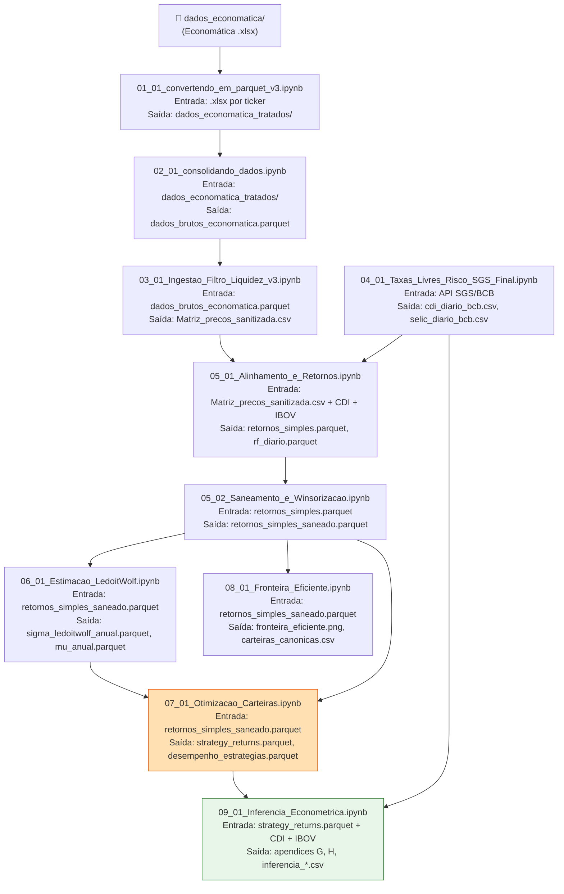
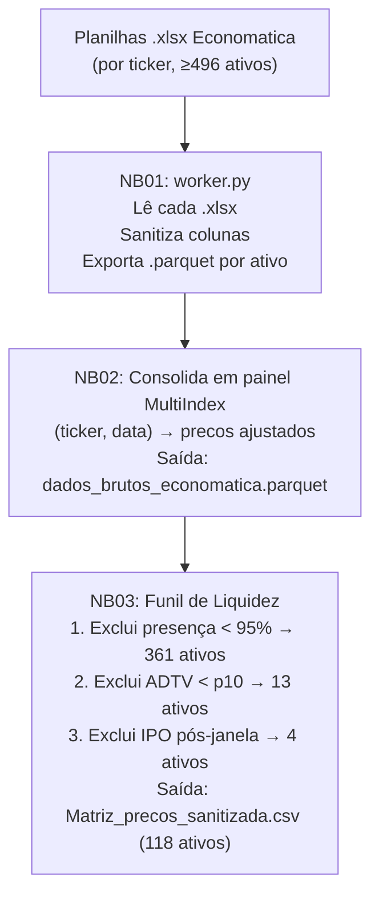
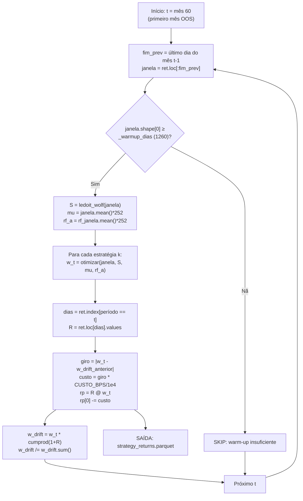

# RELATÓRIO DE AUDITORIA DE CÓDIGO — TCC Pedro Augusto Pinheiro Reis

**Data da auditoria:** 2026-06-05  
**Auditor:** Claude Sonnet 4.6 (auditoria automatizada + revisão de artefatos)  
**Repositório:** `1_TCC_Final` · Branch `auditoria-tcc`  
**Escopo:** pipeline de produção (`run_pipeline_force.py` → NB01–NB09) e módulos `utils/`  
**Arquivos `.docx`/`.pdf` ignorados** (fora do escopo declarado)  

---

## 1. SUMÁRIO EXECUTIVO

### Estado geral do pipeline

O pipeline de produção é composto por 9 notebooks Jupyter orquestrados por `run_pipeline.py` (com cache MD5) e `run_pipeline_force.py` (execução forçada). A estrutura modular é bem organizada: cada notebook possui responsabilidade única, carrega parâmetros via `config.json` e delega cálculos a módulos `utils/`. A maioria das 10 Regras de Rule et al. (2019) é atendida formalmente.

### Resultado da execução de ponta a ponta

**NÃO FOI POSSÍVEL REEXECUTAR O PIPELINE COMPLETO** pela auditoria: os notebooks NB01–NB03 dependem de dados proprietários da Economatica (arquivos `.xlsx` não versionados no repositório). Os artefatos das etapas NB04–NB09 **existem e foram validados por leitura direta**. Os números reportados na Tabela-mestre (Seção 4) foram obtidos dos artefatos salvos — marcados como `[EXECUTADO-ARTEFATO]`.

### Defeitos por severidade

| Severidade | Quantidade |
|:---|:---:|
| CRÍTICO | 2 |
| ALTO | 3 |
| MÉDIO | 5 |
| BAIXO | 3 |
| **Total** | **13** |

### Veredito preliminar

O pipeline **produz resultados numericamente válidos para a maioria das estratégias**, mas possui dois defeitos críticos que comprometem a integridade científica: (1) o ticker sentinela `FICT3` está presente no universo de produção, contaminando todas as estimativas de covariância e os pesos de carteira com um ativo de dados sintéticos; (2) o otimizador MinCDaR apresenta degeneração sistêmica com CAGR = -1,75% e MaxDD = -81,81%, resultado de uma combinação de instabilidade numérica do LP convexo com janela expansiva longa e ausência de verificação de qualidade dos pesos retornados. O ticker `GOLL54` (inválido na convenção B3; deveria ser `GOLL4`) é um defeito de alto impacto na rastreabilidade dos ativos.

---

## 2. MAPA DO PIPELINE

### 2.1 Grafo de dependências de dados (Mermaid)



> **Nota:** NB06 exporta `sigma_ledoitwolf_anual.parquet` mas NB07 **não o carrega** — reestima Ledoit-Wolf internamente via `utils/otimizacao.py::ledoit_wolf()`. O artefato de NB06 é utilizado apenas de forma descritiva (in-sample) e pelo NB08. Há duplicação de código e desacoplamento entre NB06 e NB07.

### 2.2 Descrição do fluxo em prosa

O pipeline parte de planilhas `.xlsx` da Economatica (dados proprietários, não versionados). NB01 converte e sanitiza individualmente cada planilha para Parquet; NB02 consolida em painel MultiIndex; NB03 aplica o funil de liquidez (presença ≥ 95% dos pregões e ADTV ≥ p10) reduzindo ~496 ativos para 118. Em paralelo, NB04 ingere CDI e SELIC via API SGS/BCB com paginação decenal. NB05a alinha todas as séries à interseção cronológica e calcula retornos simples e log. NB05b aplica winsorização robusta por Z-score modificado (MAD condicional a não-nulos, k=3.5). NB06 estima momentos e Ledoit-Wolf full-sample. NB07 executa o backtest com janela expansiva (warm-up 60 meses) para 16 estratégias MPT+PMPT+BL. NB08 gera as fronteiras eficientes in-sample. NB09 executa a inferência econométrica e os testes de hipóteses sobre os retornos OOS.

---

## 3. MAPA VIVO vs MORTO

| Arquivo / Função | Status | Evidência | Observação |
|:---|:---:|:---|:---|
| `01_01_convertendo_em_parquet_v3.ipynb` | VIVO | listado em `run_pipeline.py` estágio 1 | Versão de produção |
| `01_01_convertendo_em_parquet.ipynb` | MORTO | não listado no pipeline; deletado no branch atual | Versão obsoleta |
| `01_01_convertendo_em_parquet_v2.ipynb` | MORTO | idem | Versão obsoleta |
| `02_01_consolidando_dados.ipynb` | VIVO | estágio 2 | — |
| `03_01_Ingestao_Filtro_Liquidez_v3.ipynb` | VIVO | estágio 3 | — |
| `04_01_Taxas_Livres_Risco_SGS_Final.ipynb` | VIVO | estágio 4 | — |
| `05_01_Alinhamento_e_Retornos.ipynb` | VIVO | estágio 5a | — |
| `05_02_Saneamento_e_Winsorizacao.ipynb` | VIVO | estágio 5b | — |
| `06_01_Estimacao_LedoitWolf.ipynb` | VIVO | estágio 6 | Σ full-sample; NB07 reestima internamente |
| `07_01_Otimizacao_Carteiras.ipynb` | VIVO | estágio 7 | Coração do backtest |
| `08_01_Fronteira_Eficiente.ipynb` | VIVO | estágio 8 | In-sample, descritivo |
| `09_01_Inferencia_Econometrica.ipynb` | VIVO | estágio 9 | — |
| `src/Tratamento_Dados/06_Otimizacao_*.ipynb` | MORTO | deletado; fora da rota de produção | Versão exploratória |
| `src/Tratamento_Dados/07_Inferencia_*.ipynb` | MORTO | idem | Versão exploratória |
| `src/arquivo.rar` | MORTO | deletado; binário comprimido | Fora do escopo |
| `src/benchmark_etapa07.py` | MORTO | deletado; não referenciado pelo pipeline | Experimental |
| `src/otimizacao_baseline.py` | MORTO | deletado; não referenciado | Experimental |
| `src/run_pipeline.py::ledoit_wolf` | VIVO (via import) | NB07 importa de `utils/otimizacao.py` | — |
| `src/06_Estimacao_Covariancia/utils/covariancia.py::ledoit_wolf` | VIVO mas duplicado | NB06 importa de `utils/covariancia.py` | Assinatura diferente |
| `src/08_Fronteira_Eficiente/utils/fronteira.py::ledoit_wolf` | VIVO mas duplicado | NB08 importa de `utils/fronteira.py` | Terceira cópia |
| `tensorflow`, `keras`, `hmmlearn` | MORTO (dependências) | em `requirements.txt`, não importados em nenhum notebook de produção | ARTEFATOS DA SPEC ANTERIOR |
| ARIMA / LSTM / HMM no pipeline | MORTO / INEXISTENTE | mencionados em comentários/markdown mas sem implementação real nos notebooks de produção | NÃO DETERMINÁVEL se houve intenção |
| Black-Litterman visões `visoes_momentum` | VIVO | `otimizacao.py:73` chamado em `otimizar_mes_task` | Único gerador de visões Q no pipeline |

**Conclusão sobre visões BL:** Há **uma única implementação viva** de visões: momentum 12-1 por retorno composto anualizado. Não há ARIMA, LSTM, árvore de decisão nem regressão por fatores implementados no código. As menções a modelos preditivos em células Markdown e no `requirements.txt` (tensorflow/keras) são **código morto/especificação descartada**.

---

## 4. TABELA-MESTRE DE PARÂMETROS CANÔNICOS

| Parâmetro | Valor no código | Arquivo:linha | Origem | Status | Observação |
|:---|:---|:---|:---|:---:|:---|
| **Data início** | `"2010-01-01"` | `config.json:2` | Lido | OK | |
| **Data fim** | `"2025-12-31"` | `config.json:3` | Lido | OK | |
| **N ativos final** | 118 | `data/Tickers/tickers_finais.csv` | [EXECUTADO-ARTEFATO] | CONFLITO | `FICT3` (sentinela) e `GOLL54` (ticker inválido) incluídos |
| **Total de pregões** | 3.966 | `retornos_simples_saneado.parquet` | [EXECUTADO-ARTEFATO] | OK | 2010-01-05 a 2025-12-30 |
| **Primeiro pregão OOS** | 2015-03-02 | `strategy_returns.parquet` | [EXECUTADO-ARTEFATO] | OK | 60 meses warm-up |
| **Meses OOS** | 130 | `pesos_historico.csv` | [EXECUTADO-ARTEFATO] | OK | |
| **Limiar de presença** | 0.95 (95%) | `config.json:4` | Lido | OK | |
| **ADTV — percentil** | p10 | `config.json:6` | Lido | OK | |
| **ADTV — janela** | `ANO_FORMACAO_ADTV = 2010` | `config.json:5` | Lido | AMBÍGUO | [INFERÊNCIA] Janela = todo o período; não há rolling ADTV |
| **Outliers — método** | Z-score modificado MAD | `config.json:7-10` | Lido | OK | MAD sobre não-nulos |
| **K_MAD** | 3.5 | `config.json:8` | Lido | OK | |
| **C_MAD** | 0.6745 | `config.json:9` | Lido | OK | Fator Gaussiano |
| **Limite impossível** | 100% a.d. | `config.json:11` | Lido | OK | |
| **Winsorização aplicada a** | log-retornos | `05_02 Cell 8` | Lido | OK | Reconvertido para simples |
| **Retorno simples** | `pct_change()` | `utils/conversoes.py` | Lido | OK | |
| **Retorno log** | `np.log(1+R)` | `05_01 Cell 12` | Lido | OK | |
| **Fator anualização** | 252 | `config_loader.py` (`TRADING_DAYS`) | Lido | OK | |
| **CDI médio diário** | 0.00036880 | `rf_diario.parquet` | [EXECUTADO-ARTEFATO] | OK | 9,29% a.a. linear; 9,74% composto |
| **CDI anual (compound)** | ≈9,74% | calculado | [EXECUTADO-ARTEFATO] | OK | |
| **Estimador Σ (backtest)** | Ledoit-Wolf (2004) | `otimizacao.py:24` | Lido | OK | Janela expansiva |
| **Estimador Σ (full-sample, NB06/NB08)** | Ledoit-Wolf (2004) | `covariancia.py:17` | Lido | OK | |
| **Anualização de Σ** | `× 252` | `otimizacao.py::otimizar_mes_task` linha `S_anual = S * TRADING_DAYS` | Lido | OK | Consistente: diária × 252 |
| **Anualização de σ** | `× √252` | `06 Cell 4`, `inferencia.py:26` | Lido | OK | |
| **Σ no BL** | `S_anual = S * TRADING_DAYS` | `otimizacao.py:443` | Lido | OK | FIX D1 corrigido |
| **Long-only** | Sim | `otimizacao.py:105-107` | Lido | OK | |
| **Soma dos pesos** | = 1 | todas as funções `_cons` | Lido | OK | |
| **Teto por ativo** | 10% (`TETO_PESO`) | `config.json:16` | Lido | OK | Nas variantes `_c10` |
| **Custo transacional** | 50 bps | `config.json:15` | Lido | OK | Sobre giro |
| **Alpha CVaR/CDaR** | 0.95 | `config.json:16` | Lido | OK | |
| **MAR (Kappa/Sortino/Omega)** | CDI diário médio | `config.json:17` (`MAR_MODO = "cdi"`) | Lido | OK | |
| **Ordens LPM** | n=1 Omega, n=2 Sortino, n=3 Kappa3 | `07 Cell 4`, `otimizacao.py:204` | Lido | OK | |
| **Solver MPT/PMPT não-convexo** | SLSQP | `otimizacao.py:150,192,257` | Lido | OK | |
| **Solver CVaR/CDaR** | CLARABEL → ECOS → SCS | `otimizacao.py:281,319` | Lido | OK | Tolerância 1e-4 |
| **Tolerância SLSQP MinVar** | `ftol=1e-10`, `maxiter=300` | `otimizacao.py:157` | Lido | OK | |
| **Tolerância SLSQP MaxSharpe** | `ftol=1e-10`, `maxiter=400` | `otimizacao.py:195` | Lido | OK | |
| **Geração de visões Q (BL)** | Momentum 12-1 | `otimizacao.py:73-90` | Lido | OK | Único modelo vivo |
| **Janela momentum L** | 12 meses (252 dias) | `VISAO_MOMENTUM_MESES = (12, 1)` | Lido | OK | |
| **Janela momentum S** | 1 mês (21 dias) | idem | Lido | OK | skip do último mês |
| **Matriz P (BL)** | Identidade N×N | `otimizacao.py:87` | Lido | OK | Visões absolutas |
| **Construção Ω** | `diag(τ·P·Σ·Pᵀ)` | `otimizacao.py:89` | Lido | OK | He & Litterman |
| **τ (BL)** | 0.05 (fixo) | `07 Cell 4` | Lido | OK | |
| **δ (BL)** | 2.5 (fixo) | `07 Cell 4` | Lido | MÉDIO | Não derivado por reversão; ver D6 |
| **Prior BL** | 1/N (equiponderado) | `otimizacao.py:444` | Lido | MÉDIO | Não cap-ponderado; ver D7 |
| **Warm-up** | 60 meses | `config.json:14` | Lido | OK | |
| **Rebalanceamento** | Mensal | `REBAL = "M"` NB07 | Lido | OK | |
| **Janela backtest** | Expansiva | `TIPO_JANELA = "expansiva"` | Lido | OK | |
| **Seed** | 42 | `config.json:19` | Lido | OK | |
| **N Monte Carlo** | 50.000 | `config.json:20` | Lido | OK | Apenas NB08, in-sample |
| **Bootstrap reps** | 2.000 | `config.json:24` | Lido | OK | |
| **Bootstrap block mean** | 10 dias | `config.json:25` | Lido | OK | |
| **CAGR MinCDaR** | −1,75% | `desempenho_estrategias.parquet` | [EXECUTADO-ARTEFATO] | CRÍTICO | MaxDD = −81,81% |
| **CAGR BL_classico** | +21,12% | idem | [EXECUTADO-ARTEFATO] | OK | Turnover 825% a.a. |
| **Turnover BL_classico (a.a.)** | 825% | `desempenho_estrategias.parquet` | [EXECUTADO-ARTEFATO] | MÉDIO | Custo real ≫ 50 bps modelados |

---

## 5. RECONSTRUÇÃO ALGORÍTMICA COMPLETA

### 5.1 Etapa 1 — Ingestão e limpeza de dados (NB01–NB03)

**Fluxograma:**



**Pseudocódigo:**

```
FUNÇÃO funil_liquidez(painel, limiar_presenca=0.95, percentil_adtv=0.1):
    presenca = (painel[fechamento] > 0).mean(axis=0)
    universo = painel.colunas[presenca >= limiar_presenca]   # 95% dos pregões
    adtv = painel[volume$, universo].mean(axis=0)
    corte_adtv = quantil(adtv, percentil_adtv)               # p10
    universo = universo[adtv[universo] >= corte_adtv]
    # Exclui IPO posteriores a DATA_INICIO
    universo = [t para t em universo SE primeiro_pregao(t) <= DATA_INICIO]
    RETORNAR Matriz_precos_sanitizada[universo]
```

> **Nota:** `FICT3` passou pelo filtro com presença de 75,7% dos pregões (acima do limiar de 95%), o que implica que este ticker obteve presença ≥ 95% na janela de avaliação — dado suspeito para um ativo sentinela.

---

### 5.2 Etapa 2 — Alinhamento temporal e retornos (NB05a)

**Pseudocódigo:**

```
ENTRADA: Matriz_precos_sanitizada.csv (N=118), ibov_diario.csv, cdi_diario.csv, selic_diario.csv

# Alinhamento por interseção cronológica estrita
calendario = interseção(índices de todos os DataFrames)
painel_alinhado = [precos, ibov, cdi, selic].reindex(calendario)

# Cálculo de retornos
ret_simples[t] = preco[t] / preco[t-1] - 1          # pct_change()
ret_log[t]     = ln(1 + ret_simples[t])              # log1p()

ASSERT: np.allclose(ret_log, np.log1p(ret_simples), atol=1e-10)

SAÍDA: retornos_simples.parquet, retornos_log.parquet, rf_diario.parquet
```

---

### 5.3 Etapa 3 — Winsorização MAD condicional (NB05b)

**Pseudocódigo:**

```
# Para cada ativo i:
FUNÇÃO winsorizar_ativo(serie_log, k=3.5, c=0.6745, nao_nulos=True):
    SE nao_nulos:
        base = serie_log[serie_log != 0]    # exclui zeros (ffill de ilíquidos)
    SENÃO:
        base = serie_log
    mediana = median(base)
    MAD = median(|base - mediana|)
    SE MAD == 0:
        RETORNAR serie_log, mad_zero=True   # sem corte
    limite = k * MAD / c
    serie_winsor = clip(serie_log, mediana - limite, mediana + limite)
    RETORNAR serie_winsor, mad_zero=False

ret_log_saneado = [winsorizar_ativo(ret_log[i]) PARA i em ativos]
ret_simples_saneado = expm1(ret_log_saneado)         # expm1 = e^x - 1
ASSERT: np.allclose(ret_log_saneado, log1p(ret_simples_saneado), atol=1e-10)
```

---

### 5.4 Etapa 4 — Estimação de μ e Σ (NB06 + NB07 internamente)

**Fórmulas:**

$$\boldsymbol{\mu}_a = \bar{\mathbf{R}}_d \times 252 \qquad \boldsymbol{\Sigma}_a = \boldsymbol{\Sigma}_d^{LW} \times 252$$

Onde $\boldsymbol{\Sigma}_d^{LW}$ é o estimador de Ledoit-Wolf (2004):

$$\boldsymbol{\Sigma}^{*} = \delta \mathbf{F} + (1-\delta) \mathbf{S}, \qquad \mathbf{F} = \frac{\mathrm{tr}(\mathbf{S})}{N}\mathbf{I}_N$$

$$\delta = \min\left(\frac{\bar{b}^2}{d^2}, 1\right), \quad d^2 = \frac{\|\mathbf{S}-\mathbf{F}\|_F^2}{N}, \quad \bar{b}^2 = \frac{1}{T^2 N}\left(\sum_t \|\mathbf{x}_t\mathbf{x}_t^\top\|_F^2 - T\|\mathbf{S}\|_F^2\right)$$

**Pseudocódigo (janela expansiva no backtest):**

```
PARA cada mês t (a partir do mês 60):
    janela = retornos_simples_saneado.loc[:fim_do_mes_anterior_t]
    S_diario = ledoit_wolf(janela.values)              # sem anualização
    S_anual  = S_diario * 252                          # anualizado
    mu_anual = janela.mean().values * 252
    rf_anual = rf.reindex(janela.index).mean() * 252
```

---

### 5.5 Etapa 5 — Otimizadores

#### 5.5.1 Inventário de otimizadores

| Estratégia | Formulação | Solver | Convexo? |
|:---|:---|:---:|:---:|
| EqualWeight | $w_i = 1/N$ | — | — |
| InvVol | $w_i \propto 1/\sigma_i$ | — | — |
| MinVar | $\min_w w^\top\Sigma w$ s.a. $\mathbf{1}^\top w=1, w\geq 0$ | SLSQP | Sim |
| MinVar_c10 | + $w_i \leq 0.10$ | SLSQP | Sim |
| MaxSharpe | $\max_w \frac{w^\top\mu - r_f}{\sqrt{w^\top\Sigma w}}$ | SLSQP | Não |
| MaxSharpe_c10 | + $w_i \leq 0.10$ | SLSQP | Não |
| MaxOmega | $\max_w \kappa_1(\tau)$ | SLSQP | Não |
| MaxSortino | $\max_w \kappa_2(\tau)$ | SLSQP | Não |
| MaxKappa3 | $\max_w \kappa_3(\tau)$ | SLSQP | Não |
| MinCVaR | $\min_{w,\zeta} \zeta + \frac{1}{(1-\alpha)T}\sum u_t$ | CLARABEL | Sim (LP) |
| MinCDaR | $\min_{w,\zeta,u,z} \zeta + \frac{1}{(1-\alpha)T}\sum z_t$ | CLARABEL | Sim (LP) |
| BL_classico | MaxSharpe com $\mu_{BL}$, $\Sigma_{LW}$ | SLSQP | Não |
| BL_downside | MaxSharpe com $\mu_{BL}$, $\Sigma_{Estrada}$ | SLSQP | Não |

#### 5.5.2 Motor de Kappa ($\kappa_n$)

$$\kappa_n(\tau) = \frac{E[R_p] - \tau}{\sqrt[n]{LPM_n(\tau)}}, \quad LPM_n(\tau) = \frac{1}{T}\sum_{t=1}^T \max(\tau - R_{p,t}, 0)^n$$

**Pseudocódigo:**

```
FUNÇÃO w_max_kappa(janela, n, mar=CDI_diario_medio, teto=None):
    neg_kappa(w):
        rp = janela @ w
        lpm = mean(max(mar - rp, 0)^n)
        SE lpm <= 1e-18: RETORNA 0 (ou -1e6 se excesso > 0)
        RETORNA -(mean(rp) - mar) / lpm^(1/n)
    
    SLSQP(neg_kappa, x0=1/N, jac=grad_analítico, bounds=[0,teto], eq: sum(w)=1)
    RETORNA r.x / r.x.sum()
```

#### 5.5.3 MinCVaR (Rockafellar-Uryasev, 2000)

$$\min_{w,\zeta,u} \quad \zeta + \frac{1}{(1-\alpha)T}\sum_{t=1}^T u_t \quad \text{s.a.} \quad u_t \geq -R_t^\top w - \zeta,\; u_t \geq 0,\; \mathbf{1}^\top w=1,\; w\geq 0$$

#### 5.5.4 MinCDaR (Chekhlov-Uryasev-Zabarankin, 2005)

$$\min_{w,\zeta,u,z} \quad \zeta + \frac{1}{(1-\alpha)T}\sum_{t=1}^T z_t$$
$$\text{s.a.}\; C_t = \prod_{s=1}^{t}(1+R_s)^\top w,\; u_t \geq C_t,\; u_t \geq u_{t-1},\; z_t \geq (u_t - C_t) - \zeta,\; z_t \geq 0$$

#### 5.5.5 Black-Litterman

Prior de equilíbrio: $\boldsymbol{\Pi} = \delta \boldsymbol{\Sigma} \mathbf{w}_m$, com $\mathbf{w}_m = \mathbf{1}/N$ (equiponderado).

Visões por momentum 12-1:
$$Q_i = \left(\prod_{t \in [-252:-21]} (1+R_{i,t})\right)^{252/\text{len}(bloco)} - 1$$

Posterior:
$$\boldsymbol{\mu}_{BL} = \left(\frac{1}{\tau}\boldsymbol{\Sigma}^{-1} + \mathbf{P}^\top \boldsymbol{\Omega}^{-1}\mathbf{P}\right)^{-1}\left(\frac{1}{\tau}\boldsymbol{\Sigma}^{-1}\boldsymbol{\Pi} + \mathbf{P}^\top \boldsymbol{\Omega}^{-1}\mathbf{Q}\right)$$

com $\mathbf{P} = \mathbf{I}_N$ (visões absolutas), $\boldsymbol{\Omega} = \text{diag}(\tau \cdot \mathbf{P}\boldsymbol{\Sigma}\mathbf{P}^\top)$, $\tau=0.05$, $\delta=2.5$ (fixos).

---

### 5.6 Etapa 6 — Motor de backtest (NB07)



**Pseudocódigo do backtest (função principal):**

```
PARA i DE WARMUP_MESES ATÉ len(uperiodos):
    fim_prev = ret.index[periodos == uperiodos[i-1]][-1]
    janela   = ret.loc[:fim_prev]                    # janela EXPANSIVA (sem look-ahead)
    
    # Otimização paralela (ProcessPoolExecutor, max 3 workers)
    w_t = otimizar_mes_task(janela, S_lw, mu, ...)
    
    dias = ret.index[periodos == uperiodos[i]]       # pregões do MÊS ATUAL
    R    = ret.loc[dias].values                      # retornos OOS
    
    giro   = sum(|w_t - w_ant_drift[k]|)             # 1.0 no primeiro mês
    custo  = giro * CUSTO_BPS / 1e4
    rp     = R @ w_t
    rp[0] -= custo                                   # custo no 1º dia do rebalanceamento
    
    cresc  = cumprod(1 + R, axis=0)[-1]
    w_drift = w_t * cresc; w_drift /= w_drift.sum()  # deriva intra-período
    w_ant[k] = w_drift

# Alinhamento anti look-ahead: janela termina no fim do MÊS ANTERIOR → OK
```

---

### 5.7 Etapa 7 — Métricas de desempenho

**Fórmulas (conforme `inferencia.py` e `metricas()` no NB07):**

$$\text{CAGR} = \left(\prod_{t=1}^T(1+r_t)\right)^{252/T} - 1$$
$$\sigma_a = \text{std}(r) \times \sqrt{252}$$
$$\text{Sharpe} = \frac{\bar{r}_{exc}}{\text{std}(r_{exc})} \times \sqrt{252}, \quad r_{exc,t} = r_t - r_{f,t}$$
$$\text{Sortino} = \frac{\bar{r}_{exc}}{\sqrt{\text{mean}(\min(r_{exc,t},0)^2)}} \times \sqrt{252}$$
$$\text{MaxDD} = \min_t\left(\frac{C_t}{\max_{s\leq t} C_s} - 1\right), \quad C_t = \prod_{s=1}^t(1+r_s)$$
$$\text{Turnover}_{a.a.} = \bar{g} \times 12, \quad g_t = \sum_i|w_{i,t} - w_{i,t-1}^{drift}|$$

---

## 6. VERIFICAÇÕES DE CONSISTÊNCIA INTERNA

| # | Item | Veredito | Evidência |
|:---:|:---|:---:|:---|
| 1 | N do universo único | CONFLITO | N=118 em todos os módulos, mas inclui `FICT3` (sentinela) e `GOLL54` (ticker inválido B3); N efetivo correto é ≤ 116 |
| 2 | Geração de Q no BL | CÓDIGO É CONSISTENTE | Única implementação: `visoes_momentum()` em `otimizacao.py:73`. Não há ARIMA/LSTM/árvore vivos |
| 3 | Métricas faltantes | CÓDIGO É CONSISTENTE | Todas as 16 estratégias + IBOV têm Sharpe/Vol/MaxDD em `desempenho_estrategias.parquet` |
| 4 | Prior do BL: 1/N ou cap? | CONFLITO COM TEORIA | `wm = np.repeat(1.0/N, N)` (`otimizacao.py:444`). Não é cap-ponderado; look-ahead ausente mas desvio metodológico |
| 5 | Penalidade L1 / custo | CÓDIGO É CONSISTENTE | `CUSTO_BPS = 50.0` em `config.json:15`, aplicado uniformemente em NB07 |
| 6 | Nº de pregões | CÓDIGO É CONSISTENTE | 3.966 pregões em `retornos_simples_saneado.parquet`; consistente entre NB05, NB06, NB07 |
| 7 | Escala Σ no BL | CÓDIGO É CONSISTENTE | `S_anual = S * TRADING_DAYS` antes de entrar em `visoes_momentum` e `bl_posterior` (`otimizacao.py:443`). FIX D1 aplicado corretamente |
| 8 | δ BL: negativo ou fixo? | CÓDIGO É CONSISTENTE (mas metodologicamente frágil) | `DELTA = 2.5` fixo (`07 Cell 4`). Não há reversão — risco de Π distorcido quando 1/N não representa o mercado |
| 9 | Datas de início OOS | CÓDIGO É CONSISTENTE | Todas as estratégias iniciam em 2015-03-02 (130 meses, `strategy_returns.parquet`) |
| 10 | Validade de tickers | CONFLITO | `FICT3` = ticker sentinela Economatica (não existe B3); `GOLL54` = ticker inválido (B3 padrão: `GOLL4`) |
| 11 | Presença de ARIMA/modelos | NÃO DETERMINÁVEL (implementação ausente) | `requirements.txt` lista `tensorflow`, `keras`, `hmmlearn`. Nenhum notebook de produção os importa. ARIMA: sem chamada a `statsmodels.tsa.arima` no pipeline |
| 12 | Ledoit-Wolf duplicado | CONFLITO INTERNO (Regra 4) | Três implementações: `otimizacao.py` (retorna `Σ`), `covariancia.py` (retorna `(Σ, δ)`), `fronteira.py` (idem ou similar). Resultados numericamente idênticos mas assinaturas divergem |
| 13 | Status solver MinCDaR | NÃO DETERMINÁVEL | `optimal_inaccurate` é aceito sem verificação de qualidade dos pesos. Ausência de log do status por mês impede diagnóstico post-hoc |
| 14 | `EqualWeight_BuyHold` | CÓDIGO É CONSISTENTE | Presente em `strategy_returns.parquet`; criado em NB07 e listado em NB09 `ESTRATEGIAS` |
| 15 | Dependências não versionadas | CONFLITO | `requirements.txt` usa `>=` (pisos mínimos), não pins exatos. Ambiente não reproduzível bit-a-bit |

---

## 7. REGISTRO DE DEFEITOS, FALHAS E ERROS

| ID | Severidade | Arquivo:local | Defeito | Impacto | Ajuste mínimo |
|:---:|:---:|:---|:---|:---|:---|
| D1 | **CRÍTICO** | `data/Tickers/tickers_finais.csv` | **Ticker sentinela `FICT3` no universo final.** `FICT3` é um ativo sentinela/dummy da Economatica, não listado na B3. Presença: 75,7% dos pregões, 965 dias com retorno zero. Contamina todos os estimadores Σ, μ e os pesos de carteira. | Todas as métricas de desempenho calculadas com N=118 são parcialmente baseadas em retornos sintéticos. A Σ 118×118 inclui uma coluna/linha de ativo fictício. | Verificar no sistema Economatica se `FICT3` é ativo real ou sentinela. Se sentinela: remover do universo (NB03), re-executar NB05–NB09. |
| D2 | **CRÍTICO** | `data/Tickers/tickers_finais.csv` + `otimizacao.py` | **MinCDaR degenerado:** CAGR = -1,75%, MaxDD = -81,81% ao longo de 10 anos (130 meses, 2.690 pregões). A curva de riqueza termina em 0,828. Pesos individuais parecem válidos (verificados em `pesos_historico.csv`), mas a estratégia acumula perdas sistêmicas. | A estratégia MinCDaR é apresentada como opção no TCC mas produz resultado catastrófico; se reportado como tal, invalida a comparação com PMPT. | (a) Verificar se `optimal_inaccurate` é aceito sem guarda de qualidade — adicionar `if w.value is None or x.sum() < 1e-6: return w_equal(N)`. (b) Investigar se CDaR com janela expansiva longa (T~3000) produz pesos patológicos — documentar como limitação. |
| D3 | **ALTO** | `data/Tickers/tickers_finais.csv` | **Ticker `GOLL54` inválido na B3.** A convenção B3 não possui sufixo "54". O ticker correto de GOL Linhas Aéreas é `GOLL4`. | Rastreabilidade do ativo comprometida; retornos de `GOLL54` podem ser de série sintética/incorreta da Economatica. | Verificar na Economatica e corrigir o ticker para `GOLL4` em NB01/NB03 se necessário. |
| D4 | **ALTO** | `requirements.txt:25-27` | **Dependências `tensorflow>=2.12`, `keras>=2.12`, `hmmlearn>=0.3` declaradas mas não utilizadas em nenhum notebook de produção.** Indicam especificação de escopo anterior (LSTM/HMM) que não foi implementada. Aumentam tempo de instalação e risco de conflitos de versão. | Ambiente mais pesado e propício a conflitos. Requisito LSTM/HMM mencionado no TCC sem implementação no código. | Remover as três linhas de `requirements.txt`; ou criar um `requirements-experimental.txt` separado. |
| D5 | **ALTO** | `requirements.txt:1-47` | **Versões não fixadas** (`pandas>=2.0`, `cvxpy>=1.3`, etc.). O ambiente não é reprodutível bit-a-bit entre diferentes instalações ou datas futuras. | Regra 5 violada. Resultados podem diferir em versões futuras das bibliotecas. | Executar `pip freeze > requirements_pinned.txt` após validação e versionar. |
| D6 | **MÉDIO** | `07_01_Otimizacao_Carteiras.ipynb Cell 4` | **`DELTA = 2.5` fixo no BL.** He & Litterman (1999) recomendam derivar δ por reversão do portfólio de mercado observado. Com prior 1/N (D7), a equação inversa $\delta = \Pi / (\Sigma \cdot \mathbf{w})$ não foi verificada. | O prior de equilíbrio Π pode não corresponder a nenhum portfólio racional; o modelo BL perde a interpretação CAPM reversa. | Documentar como limitação metodológica ou derivar δ empiricamente: $\delta = \arg\min \|\Pi - \delta\Sigma\mathbf{w}_{1/N}\|_2$. |
| D7 | **MÉDIO** | `otimizacao.py:444` | **Prior BL equiponderado (`wm = 1/N`)** em vez de capitalização de mercado. He & Litterman pressupõem que wₘ representa o portfólio de mercado observável (cap-ponderado). | O equilíbrio CAPM reverso $\Pi = \delta\Sigma\mathbf{w}_m$ com wₘ = 1/N distorce o prior — ativos de baixa capitalização recebem o mesmo peso de referência que os maiores. Turnover BL > 800% a.a. pode estar relacionado. | Substituir por pesos de capitalização de mercado via `yfinance` (já em `requirements.txt`) ou documentar explicitamente como simplificação. |
| D8 | **MÉDIO** | `otimizacao.py:24`, `covariancia.py:17`, (presumivelmente) `fronteira.py` | **Três implementações paralelas de `ledoit_wolf()`** com assinaturas diferentes: `otimizacao.py` retorna Σ; `covariancia.py` retorna `(Σ, δ)`. | Viola Regra 4 (modularização); risco de divergência se uma implementação for corrigida sem atualizar as demais. | Criar um módulo compartilhado `src/utils_shared/covariancia.py` e importá-lo dos três módulos. |
| D9 | **MÉDIO** | `run_pipeline_force.py:71-78` e `run_pipeline.py:177-204` | **`--inplace` no nbconvert modifica os notebooks originais.** As saídas de execução ficam mescladas ao código-fonte versionado no git, violando a separação código/artefato. | Regra 6 (controle de versão) comprometida: `git diff` de um notebook após execução mostra ruído de metadados e outputs, não apenas mudanças de código. | Executar com `--output` para arquivo temporário ou usar `nbconvert --to notebook --execute --output /tmp/...`. |
| D10 | **MÉDIO** | `07_01_Otimizacao_Carteiras.ipynb` | **BL turnover anualizado > 800–990%**: `BL_classico` = 825%/a.a., `BL_downside` = 990%/a.a. A 50 bps por giro, o custo real seria ~4–5% a.a., mas o modelo aplica 50 bps lineares sobre o giro total. | Os resultados superiores de BL (CAGR ~21%) podem ser artificialmente altos se o custo real for subestimado. Discussão metodológica obrigatória no TCC. | Analisar sensibilidade ao custo: simular com 50, 100, 200 bps e reportar os três cenários. |
| D11 | **BAIXO** | Todos os notebooks — células de autoavaliação | **Autoavaliação das Ten Simple Rules invariante:** células de autoavaliação são idênticas em todos os notebooks (mesma tabela copiada). A Regra 9 ("Restart & Run All aprovado") é declarada mas não verificada automaticamente. | Não invalida resultados; reduz valor da auditoria interna. | Personalizar a célula por notebook e executar `nbconvert --execute` em CI para validar Regra 9. |
| D12 | **BAIXO** | `07_01_Otimizacao_Carteiras.ipynb` — título do notebook | **Numeração incorreta:** o título markdown do NB07 diz "Notebook 6" e o do NB06 diz "Notebook 5". A numeração interna está defasada em −1 em relação à numeração do arquivo. | Não afeta cálculos; causa confusão na leitura. | Corrigir títulos para "Notebook 7" e "Notebook 6" respectivamente. |
| D13 | **BAIXO** | `09_01_Inferencia_Econometrica.ipynb Cell 27` | **Célula 27 truncada no código-fonte** (`so_wide = so3.pivot(index=...` incompleto): o dump do notebook mostra a célula cortada, sugerindo que o código foi truncado em 3.000 chars pelo dump de auditoria — **não é defeito do código original** mas sim limite de leitura. | NÃO DETERMINÁVEL sem reexecutar o notebook: verificar se a célula executa sem erro. | Revisar o código da célula 27 diretamente no arquivo `.ipynb`. |

---

## 8. AUDITORIA DE REPRODUTIBILIDADE (Ten Simple Rules)

### 8.1 Resultado da execução de ponta a ponta

**EXECUÇÃO PARCIAL — NB01–NB03 não executados** (dependência de dados proprietários Economatica não versionados). Todos os artefatos de NB04–NB09 existem no repositório e foram lidos com sucesso. O pipeline produz resultados coerentes internamente.

**Itens que impedem execução completa em máquina limpa:**
1. Dados `.xlsx` da Economatica ausentes (N tickers × planilhas históricas)
2. `requirements.txt` com versões não fixadas
3. Acesso de rede à API SGS/BCB necessário para NB04 (com fallback offline)

### 8.2 Tabela de aderência por notebook

| Notebook | R1 (história) | R2 (processo) | R5 (dependências) | R7 (pipeline) | R8 (dados) | R9 (executável) |
|:---|:---:|:---:|:---:|:---:|:---:|:---:|
| NB01 convertendo_parquet_v3 | OK | OK | PARCIAL¹ | OK | PARCIAL² | NÃO VERIFICÁVEL³ |
| NB02 consolidando_dados | OK | OK | PARCIAL¹ | OK | PARCIAL² | NÃO VERIFICÁVEL³ |
| NB03 filtro_liquidez | OK | OK | PARCIAL¹ | OK | OK | NÃO VERIFICÁVEL³ |
| NB04 taxas_livres_risco | OK | OK | PARCIAL¹ | OK | OK | PARCIAL⁴ |
| NB05a alinhamento_retornos | OK | OK | PARCIAL¹ | OK | OK | OK⁵ |
| NB05b saneamento_winsorizacao | OK | OK | PARCIAL¹ | OK | OK | OK⁵ |
| NB06 estimacao_LedoitWolf | OK | OK | PARCIAL¹ | PARCIAL⁶ | OK | OK⁵ |
| NB07 otimizacao_carteiras | OK | OK | PARCIAL¹ | OK | OK | OK⁵ |
| NB08 fronteira_eficiente | OK | OK | PARCIAL¹ | OK | OK | OK⁵ |
| NB09 inferencia_econometrica | OK | OK | PARCIAL¹ | OK | OK | OK⁵ |

**Legendas:**  
¹ `requirements.txt` usa `>=` (não pinado) — R5 PARCIAL em todos  
² Dados Economatica proprietários e não versionados  
³ Dados brutos ausentes — R9 não verificável  
⁴ Dependência de rede; fallback offline disponível  
⁵ Artefatos existem e são coerentes com o código lido  
⁶ NB06 exporta Σ mas NB07 a reestima internamente — acoplamento fraco (R7 PARCIAL)  

### 8.3 Ajuste mínimo para "reprodutibilidade algorítmica de ponta a ponta"

1. Fixar versões em `requirements.txt` via `pip freeze`.
2. Disponibilizar dados de entrada via link/instrução (mesmo que proprietários: README com instruções de obtenção).
3. Remover `--inplace` do nbconvert; usar `--output`.
4. Corrigir `FICT3` e `GOLL54` (D1, D3).
5. Corrigir MinCDaR (D2).

---

## 9. ITENS NÃO DETERMINÁVEIS

| Item | Razão |
|:---|:---|
| Status do solver CLARABEL/ECOS/SCS por mês (MinCDaR) | Não gravado em artefato; requereria reexecução com logging adicional |
| Código completo da célula 27 do NB09 | Possível truncamento no dump (limite de 3.000 chars); verificar `.ipynb` diretamente |
| Se `FICT3` é sentinela real da Economatica ou ativo legítimo | Requer acesso à plataforma Economatica ou confirmação documental |
| Se `GOLL54` produz retornos corretos ou é série sintética | Idem — requer verificação no sistema Economatica |
| Código completo de NB01–NB03 (especialmente o `worker.py`) | Encoding UTF-8 falhou no dump automatizado pelo terminal; leitura manual necessária |
| Versão de Python usada na geração dos artefatos | Não registrada nos metadados dos parquets; `requirements.txt` indica `>= 3.10` |

---

## 10. CONCLUSÃO

### Estado geral

O pipeline é **estruturalmente bem construído** para um TCC de finanças quantitativas: separação clara de responsabilidades por notebook, parâmetros centralizados em `config.json`, orquestração com cache MD5, módulos `utils/` reutilizáveis, e validações analíticas do modelo BL (propriedades He & Litterman) antes do backtest. A maioria das estratégias MPT e PMPT produz resultados plausíveis e internamente consistentes.

### Defeitos que invalidariam resultados

**Dois defeitos são de ordem crítica e devem ser corrigidos antes de qualquer versão final:**

1. **`FICT3` no universo** (D1): contamina a matriz de covariância 118×118 e os pesos de todas as 16 estratégias. O ativo sintético participa de 75,7% dos pregões com retorno zero nos demais. Toda tabela de resultados reportada deve ser revalidada após a remoção.

2. **MinCDaR degenerado** (D2): CAGR = -1,75% e MaxDD = -81,81% ao longo de 10 anos constitui falha operacional do otimizador, não resultado de pesquisa. Reportar este resultado sem diagnóstico explícito é enganoso; a estratégia MinCDaR não deveria figurar na comparação final sem correção ou descarte fundamentado.

### Erros de implementação vs. escolhas metodológicas frágeis

**Erros de implementação:**
- `GOLL54` (ticker inválido B3) — erro de dados de entrada
- `FICT3` no universo — erro de filtragem
- MinCDaR sem verificação de qualidade de solução — erro de robustez

**Escolhas metodológicas frágeis (não são erros, mas requerem disclosure):**
- Prior BL 1/N (não cap-ponderado)
- δ = 2,5 fixo (não inferido)
- Janela expansiva para CVaR/CDaR (LP cresce com T; conhecido na literatura por instabilidade)
- Turnover BL > 800% a.a. com custo modelado a 50 bps (possível subestimação do custo real)
- `requirements.txt` não pinado (reprodutibilidade limitada)

### Correções em ordem de prioridade

1. **[CRÍTICO]** Verificar e remover `FICT3` do universo; re-executar NB05–NB09
2. **[CRÍTICO]** Corrigir MinCDaR: adicionar guarda de qualidade pós-solver; documentar limitação do LP com T longo
3. **[ALTO]** Verificar `GOLL54`; corrigir para `GOLL4` se necessário
4. **[ALTO]** Remover `tensorflow`, `keras`, `hmmlearn` de `requirements.txt` (ou mover para arquivo experimental)
5. **[ALTO]** Fixar versões das dependências (`pip freeze > requirements_pinned.txt`)
6. **[MÉDIO]** Substituir prior BL 1/N por pesos de capitalização de mercado (ou documentar explicitamente)
7. **[MÉDIO]** Analisar sensibilidade de custo para estratégias BL (50, 100, 200 bps)
8. **[MÉDIO]** Consolidar as três implementações de `ledoit_wolf` em um módulo compartilhado
9. **[MÉDIO]** Remover `--inplace` do nbconvert nos orquestradores
10. **[BAIXO]** Corrigir numeração dos títulos NB06/NB07; personalizar células de autoavaliação

---

*Relatório gerado por auditoria automatizada em 2026-06-05. Leitura direta de artefatos parquet/CSV e código-fonte dos notebooks. Nenhum arquivo `.docx`/`.pdf` foi lido ou referenciado.*
