# Auditoria de Arquitetura do Pipeline de Otimização de Carteiras

**Projeto:** Moderna Teoria das Carteiras no Mercado de Ações Brasileiro  
**Autor do TCC:** Pedro Augusto Pinheiro Reis — UFG, Ciências Contábeis  
**Data da auditoria:** 2026-06-03  
**Auditor:** Claude Sonnet 4.6 (automatizado)

---

## Seção 1 — Fluxo de Dados

O diagrama abaixo representa cada notebook como nó retangular e cada artefato de dados como nó de losango. As setas indicam leitura (`-->|lê|`) ou escrita (`-->|escreve|`).

```mermaid
flowchart LR
    %% --- Fontes externas ---
    RAW_ECON{{"dados_brutos_economatica\n(.parquet ou .csv)"}}
    RAW_IBOV{{"ibov_diario_2010_2026.csv"}}
    RAW_CDI{{"cdi_diario_bcb_2010_atual.csv"}}
    RAW_SELIC{{"selic_diario_bcb_2010_atual.csv"}}

    %% --- Notebook 03 ---
    NB03["03_01_Ingestao_Filtro_Liquidez_v3\n(Filtro de Liquidez)"]
    MATRIZ_PRECOS{{"Matriz_precos_sanitizada.csv"}}
    TICKERS_EXCL{{"tickers_excluidos.csv"}}
    AUDIT_LOG{{"auditoria_exclusoes.csv (e .json)"}}

    RAW_ECON -->|lê| NB03
    NB03 -->|escreve| MATRIZ_PRECOS
    NB03 -->|escreve| TICKERS_EXCL
    NB03 -->|escreve| AUDIT_LOG

    %% --- Notebook 04 ---
    NB04["04_01_Taxas_Livres_Risco_SGS_Final\n(Taxas Livres de Risco)"]
    CDI_OUT{{"cdi_diario_bcb_2010_atual.csv"}}
    SELIC_OUT{{"selic_diario_bcb_2010_atual.csv"}}

    NB04 -->|escreve| CDI_OUT
    NB04 -->|escreve| SELIC_OUT

    %% --- Notebook 05_01 ---
    NB05A["05_01_Alinhamento_e_Retornos\n(Alinhamento e Retornos)"]
    PAINEL_ALINHADO{{"painel_alinhado\n(.parquet e .csv)"}}
    RET_SIMPLES{{"retornos_simples\n(.parquet e .csv)"}}
    RET_LOG{{"retornos_log\n(.parquet e .csv)"}}
    IBOV_RET{{"ibov_retornos\n(.parquet e .csv)"}}
    RF_DIARIO{{"rf_diario\n(.parquet e .csv)"}}
    TICKERS_FINAIS{{"tickers_finais.csv"}}

    MATRIZ_PRECOS -->|lê| NB05A
    RAW_IBOV -->|lê| NB05A
    CDI_OUT -->|lê| NB05A
    SELIC_OUT -->|lê| NB05A
    NB05A -->|escreve| PAINEL_ALINHADO
    NB05A -->|escreve| RET_SIMPLES
    NB05A -->|escreve| RET_LOG
    NB05A -->|escreve| IBOV_RET
    NB05A -->|escreve| RF_DIARIO
    NB05A -->|escreve| TICKERS_FINAIS

    %% --- Notebook 05_02 ---
    NB05B["05_02_Saneamento_e_Winsorizacao\n(Winsorizacao)"]
    RET_SIMPLES_SAN{{"retornos_simples_saneado\n(.parquet e .csv)"}}
    RET_LOG_SAN{{"retornos_log_saneado\n(.parquet e .csv)"}}
    LOG_WINSOR{{"log_winsorizacao.csv"}}
    VERIF_CORP{{"verificacao_eventos_corporativos.csv"}}

    RET_SIMPLES -->|lê| NB05B
    RET_LOG -->|lê| NB05B
    PAINEL_ALINHADO -->|lê| NB05B
    NB05B -->|escreve| RET_SIMPLES_SAN
    NB05B -->|escreve| RET_LOG_SAN
    NB05B -->|escreve| LOG_WINSOR
    NB05B -->|escreve| VERIF_CORP

    %% --- Notebook 06 ---
    NB06["06_01_Estimacao_LedoitWolf\n(Estimacao de Covariancia)"]
    MOMENTOS_ANUAIS{{"momentos_anuais\n(.csv e .parquet)"}}
    MU_ANUAL{{"mu_anual\n(.csv e .parquet)"}}
    SIGMA_AMOSTRAL{{"sigma_amostral_anual\n(.csv e .parquet)"}}
    CORRELACAO{{"correlacao\n(.csv e .parquet)"}}
    SIGMA_LW{{"sigma_ledoitwolf_anual\n(.csv e .parquet)"}}

    RET_SIMPLES_SAN -->|lê| NB06
    RF_DIARIO -->|lê| NB06
    NB06 -->|escreve| MOMENTOS_ANUAIS
    NB06 -->|escreve| MU_ANUAL
    NB06 -->|escreve| SIGMA_AMOSTRAL
    NB06 -->|escreve| CORRELACAO
    NB06 -->|escreve| SIGMA_LW

    %% --- Notebook 07 ---
    NB07["07_01_Otimizacao_Carteiras\n(Otimizacao e Backtest)"]
    STRAT_RETURNS{{"strategy_returns\n(.parquet e .csv)"}}
    DESEMPENHO{{"desempenho_estrategias\n(.parquet e .csv)"}}
    PESOS_HIST{{"pesos_historico.csv"}}
    EW_BH_RANK{{"equalweight_buyhold_ranking.csv"}}

    RET_SIMPLES_SAN -->|lê| NB07
    IBOV_RET -->|lê| NB07
    RF_DIARIO -->|lê| NB07
    NB07 -->|escreve| STRAT_RETURNS
    NB07 -->|escreve| DESEMPENHO
    NB07 -->|escreve| PESOS_HIST
    NB07 -->|escreve| EW_BH_RANK

    %% --- Notebook 08 ---
    NB08["08_01_Fronteira_Eficiente\n(Fronteira Eficiente)"]
    FRONT_MV{{"fronteira_mv_pontos.csv"}}
    FRONT_CVAR{{"fronteira_cvar_pontos.csv"}}
    CART_CANON{{"carteiras_canonicas.csv"}}
    FIG_PNG{{"fronteira_eficiente.png / .svg"}}

    RET_SIMPLES_SAN -->|lê| NB08
    RF_DIARIO -->|lê| NB08
    NB08 -->|escreve| FRONT_MV
    NB08 -->|escreve| FRONT_CVAR
    NB08 -->|escreve| CART_CANON
    NB08 -->|escreve| FIG_PNG

    %% --- Notebook 09 ---
    NB09["09_01_Inferencia_Econometrica\n(Inferencia Econometrica)"]
    APEND_G{{"apendice_G_diagnostico_ibov.csv"}}
    APEND_H{{"apendice_H_testes_estrategia.csv"}}
    APEND_H_MET{{"apendice_H_painel_metricas.csv"}}
    APEND_H_RF{{"apendice_H_comparativo_rf.csv"}}
    INFER_DIAG{{"inferencia_diagnosticos.csv"}}
    INFER_SR{{"inferencia_sharpe_testes.csv"}}
    INFER_SO{{"inferencia_sortino_testes.csv"}}
    INFER_SR3{{"inferencia_sharpe_3benchmarks.csv"}}

    STRAT_RETURNS -->|lê| NB09
    RAW_IBOV -->|lê| NB09
    CDI_OUT -->|lê| NB09
    NB09 -->|escreve| APEND_G
    NB09 -->|escreve| APEND_H
    NB09 -->|escreve| APEND_H_MET
    NB09 -->|escreve| APEND_H_RF
    NB09 -->|escreve| INFER_DIAG
    NB09 -->|escreve| INFER_SR
    NB09 -->|escreve| INFER_SO
    NB09 -->|escreve| INFER_SR3
```



---

## Seção 2 — Dependências de Módulos

```mermaid
graph TD
    subgraph "Notebooks"
        NB03["03_01_Filtro_Liquidez"]
        NB04["04_01_Taxas_Livres_Risco"]
        NB05A["05_01_Alinhamento_e_Retornos"]
        NB05B["05_02_Saneamento_e_Winsorizacao"]
        NB06["06_01_Estimacao_LedoitWolf"]
        NB07["07_01_Otimizacao_Carteiras"]
        NB08["08_01_Fronteira_Eficiente"]
        NB09["09_01_Inferencia_Econometrica"]
    end

    subgraph "Módulos utilitários"
        CFG03["03/utils/config_loader.py"]
        CFG04["04/utils/config_loader.py"]
        CFG05A["05A/utils/config_loader.py"]
        CFG05B["05B/utils/config_loader.py"]
        CFG06["06/utils/config_loader.py"]
        CFG07["07/utils/config_loader.py"]
        CFG08["08/utils/config_loader.py"]
        CFG09["09/utils/config_loader.py"]

        OTM["07/utils/otimizacao.py"]
        COV["06/utils/covariancia.py"]
        FRONT["08/utils/fronteira.py"]
        INF["09/utils/inferencia.py"]

        FILTROS["03/utils/filtros.py"]
        AUDIT03["03/utils/auditoria.py"]
        TAXAS_L["04/utils/taxas_loader.py"]
        AUDIT_T["04/utils/auditoria_taxas.py"]
        ECONOM["04/utils/econometria.py"]
        PERSIST["04/utils/persistencia.py"]
        VIZ04["04/utils/visualizacao.py"]
        ALIGN["05A/utils/alinhamento.py"]
        CONV["05A/utils/conversoes.py"]
        WINSOR["05B/utils/winsorizacao.py"]
        AUDIT05B["05B/utils/auditoria.py"]
    end

    NB03 --> CFG03
    NB03 --> FILTROS
    NB03 --> AUDIT03

    NB04 --> CFG04
    NB04 --> TAXAS_L
    NB04 --> AUDIT_T
    NB04 --> ECONOM
    NB04 --> PERSIST
    NB04 --> VIZ04

    NB05A --> CFG05A
    NB05A --> ALIGN
    NB05A --> CONV

    NB05B --> CFG05B
    NB05B --> WINSOR
    NB05B --> AUDIT05B

    NB06 --> CFG06
    NB06 --> COV

    NB07 --> CFG07
    NB07 --> OTM

    NB08 --> CFG08
    NB08 --> FRONT

    NB09 --> CFG09
    NB09 --> INF

    %% Dependências internas entre módulos
    OTM -- "ledoit_wolf, estimar_sigma\nestrada_semicov, visoes_momentum\nbl_posterior" --> OTM
    FRONT -- "ledoit_wolf (local)\nmin_var, max_sharpe\nmin_cvar, cvar_diario" --> FRONT
    INF -- "stationary_bootstrap_idx\nusado por bootstrap_ic\nlw_bootstrap_sharpe\nlw_bootstrap_sortino" --> INF
```



---

## Seção 3 — Catálogo de Funções

### 3.1 Módulo `src/07_Otimizacao_Carteiras/utils/otimizacao.py`

---

#### `ledoit_wolf(X)`

**Assinatura real** (linha 24):
```python
def ledoit_wolf(X):
```

| Parâmetro | Tipo inferido | Descrição |
|---|---|---|
| `X` | `np.ndarray` (T × N) | Matriz de retornos históricos (T observações, N ativos) |

**Retorno:** `np.ndarray` (N × N) — matriz de covariância diária encolhida (sem anualização).

**Pseudocódigo:**
```
1. Converte X para float64.
2. Extrai T (linhas) e N (colunas).
3. Centraliza: Xc = X - média_colunar.
4. Calcula covariância amostral S = Xc'Xc / T  (ddof=0).
5. Define alvo isotrópico F = (trace(S)/N) * I_N.
6. Calcula d2 = ||S - F||_F^2 / N.
7. Se d2 == 0, retorna S (já isotrópica).
8. Calcula b2bar vetorizado: term1 = sum(||Xc_t||^4); term2 = T*||S||_F^2.
9. b2 = min(b2bar, d2); delta = b2/d2.
10. Retorna delta*F + (1-delta)*S.
```

**Dependências internas:** nenhuma.

---

#### `estimar_sigma(janela, metodo="ledoit_wolf")`

**Assinatura real** (linha 49):
```python
def estimar_sigma(janela, metodo="ledoit_wolf"):
```

| Parâmetro | Tipo inferido | Descrição |
|---|---|---|
| `janela` | `np.ndarray` (T × N) | Retornos históricos da janela de estimação |
| `metodo` | `str` | `"ledoit_wolf"` (padrão) ou `"amostral"` |

**Retorno:** `np.ndarray` (N × N) — covariância diária estimada (sem anualização).

**Pseudocódigo:**
```
1. Se metodo == "amostral":
       retorna np.cov(janela, rowvar=False).  [ddof=1, não anualizado]
2. Caso contrário (ledoit_wolf):
       retorna ledoit_wolf(janela).           [ddof=0, não anualizado]
```

**Dependências internas:** `ledoit_wolf`.

---

#### `estrada_semicov(X, mar="media")`

**Assinatura real** (linha 56):
```python
def estrada_semicov(X, mar="media"):
```

| Parâmetro | Tipo inferido | Descrição |
|---|---|---|
| `X` | `np.ndarray` (T × N) | Retornos históricos |
| `mar` | `str` ou `float` | Mínimo Retorno Aceitável: `"media"`, `"zero"` ou valor literal |

**Retorno:** `np.ndarray` (N × N) — matriz de semicovariância downside diária (escala Estrada, 2008).

**Pseudocódigo:**
```
1. Converte X para float64; extrai T, n.
2. Define tau (MAR): média amostral, zeros, ou valor fixo.
3. M = min(X - tau, 0)  → captura apenas retornos abaixo do MAR.
4. Retorna M'M / T.     → semicovariância downside (ddof=0).
```

**Dependências internas:** nenhuma.

---

#### `visoes_momentum(janela, tau_bl, Sigma, trading_days=252, visao_meses=(12,1))`

**Assinatura real** (linha 73):
```python
def visoes_momentum(janela, tau_bl, Sigma, trading_days=252, visao_meses=(12, 1)):
```

| Parâmetro | Tipo inferido | Descrição |
|---|---|---|
| `janela` | `np.ndarray` (T × N) | Retornos históricos simples |
| `tau_bl` | `float` | Incerteza relativa ao prior (τ do Black-Litterman; tipicamente 0.05) |
| `Sigma` | `np.ndarray` (N × N) ou `None` | Matriz de covariância anualizada; se `None` é recalculada |
| `trading_days` | `int` | Dias úteis por ano (252) |
| `visao_meses` | `tuple[int,int]` | Par `(L, S)` para momentum `L-S`; padrão `(12, 1)` |

**Retorno:** tupla `(P, Q, Omega)` — matrizes de visões absolutas para Black-Litterman.

**Pseudocódigo:**
```
1. Define jl = L*21 e js = S*21 (dias de pregão).
2. Se T < jl+5: Q = média de R anualizada (fallback simples).
3. Caso contrário: bloco = R[-jl:-js]; Q = retorno composto anualizado do bloco.
4. P = I_N  (visões absolutas: uma visão por ativo).
5. Sg = Sigma se fornecida, senão recalcula via ledoit_wolf*trading_days.
6. Omega = diag(max(diag(P * tau_bl*Sg * P'), 1e-8)).
7. Retorna (P, Q, Omega).
```

**Dependências internas:** `ledoit_wolf` (se `Sigma is None`).

---

#### `bl_posterior(Sigma, Pi, P, Q, Omega, tau_bl=0.05)`

**Assinatura real** (linha 93):
```python
def bl_posterior(Sigma, Pi, P, Q, Omega, tau_bl=0.05):
```

| Parâmetro | Tipo inferido | Descrição |
|---|---|---|
| `Sigma` | `np.ndarray` (N × N) | Covariância anualizada dos retornos |
| `Pi` | `np.ndarray` (N,) | Retornos de equilíbrio CAPM reverso (`delta * Sigma @ w_mkt`) |
| `P` | `np.ndarray` (K × N) | Matriz de seleção de visões |
| `Q` | `np.ndarray` (K,) | Vetor de retornos esperados das visões |
| `Omega` | `np.ndarray` (K × K) | Matriz de incerteza das visões |
| `tau_bl` | `float` | Escalar de incerteza do prior (padrão 0.05) |

**Retorno:** `np.ndarray` (N,) — vetor de retornos esperados posteriores `mu_BL` anualizados.

**Pseudocódigo:**
```
1. tauS_inv = inv(tau_bl * Sigma)
2. Om_inv   = inv(Omega)
3. A = tauS_inv + P' * Om_inv * P
4. b = tauS_inv @ Pi + P' * Om_inv @ Q
5. mu_BL = solve(A, b)   [equivale à fórmula fechada de He & Litterman]
6. Retorna mu_BL.
```

**Dependências internas:** nenhuma.

---

#### `w_equal(n)`

**Assinatura real** (linha 110):
```python
def w_equal(n):
```

| Parâmetro | Tipo inferido | Descrição |
|---|---|---|
| `n` | `int` | Número de ativos |

**Retorno:** `np.ndarray` (n,) — pesos iguais `1/n` para todos os ativos.

**Pseudocódigo:**
```
1. Retorna np.repeat(1.0/n, n).
```

**Dependências internas:** nenhuma.

---

#### `w_inv_vol(S)`

**Assinatura real** (linha 115):
```python
def w_inv_vol(S):
```

| Parâmetro | Tipo inferido | Descrição |
|---|---|---|
| `S` | `np.ndarray` (N × N) | Matriz de covariância estimada |

**Retorno:** `np.ndarray` (N,) — pesos proporcionais ao inverso da volatilidade individual, normalizados.

**Pseudocódigo:**
```
1. iv = 1 / sqrt(diag(S))   [inverso da vol individual]
2. Retorna iv / sum(iv).     [normaliza para somar 1]
```

**Dependências internas:** nenhuma.

---

#### `w_min_var(S, teto=None, long_only=True, w0=None)`

**Assinatura real** (linha 121):
```python
def w_min_var(S, teto=None, long_only=True, w0=None):
```

| Parâmetro | Tipo inferido | Descrição |
|---|---|---|
| `S` | `np.ndarray` (N × N) | Covariância estimada |
| `teto` | `float` ou `None` | Peso máximo por ativo (ex.: 0.10 para 10%); `None` = sem restrição |
| `long_only` | `bool` | Se `True`, pesos ≥ 0 |
| `w0` | `np.ndarray` ou `None` | Ponto inicial (warm-start); `None` usa `1/N` |

**Retorno:** `np.ndarray` (N,) — pesos da carteira de mínima variância global, renormalizados.

**Pseudocódigo:**
```
1. x0 = w0 se fornecido, senão w_equal(n).
2. Define restrição de igualdade: sum(w) = 1.
3. Minimiza w'Sw via SLSQP com gradiente analítico 2*S@w.
4. Aplica limites: 0 <= w_i <= teto (ou 1.0 se teto=None).
5. maxiter=300, ftol=1e-10.
6. Retorna r.x / r.x.sum()  [renormaliza para orçamento exato].
```

**Dependências internas:** `_bounds`, `w_equal`.

---

#### `w_max_sharpe(mu, S, rf_a, teto=None, long_only=True, w0=None)`

**Assinatura real** (linha 150):
```python
def w_max_sharpe(mu, S, rf_a, teto=None, long_only=True, w0=None):
```

| Parâmetro | Tipo inferido | Descrição |
|---|---|---|
| `mu` | `np.ndarray` (N,) | Retornos esperados anualizados |
| `S` | `np.ndarray` (N × N) | Covariância estimada (anualizada) |
| `rf_a` | `float` | Taxa livre de risco anualizada |
| `teto` | `float` ou `None` | Peso máximo por ativo |
| `long_only` | `bool` | Se `True`, pesos ≥ 0 |
| `w0` | `np.ndarray` ou `None` | Ponto inicial (warm-start) |

**Retorno:** `np.ndarray` (N,) — pesos da carteira de máximo Índice de Sharpe, renormalizados.

**Pseudocódigo:**
```
1. x0 = w0 se fornecido, senão w_equal(n).
2. Define neg_sharpe(w) = -(w@mu - rf_a) / sqrt(w@S@w)  [se vol > 1e-12].
3. Define grad_neg_sharpe(w):
       v2 = w@S@w; v = sqrt(v2); mu_ex = w@mu - rf_a
       retorna -(mu*v2 - mu_ex*(S@w)) / (v2*v)  [regra do quociente analítica].
4. Minimiza neg_sharpe via SLSQP com gradiente analítico.
5. maxiter=400, ftol=1e-10.
6. Retorna r.x / r.x.sum().
```

**Dependências internas:** `_bounds`, `w_equal`.

---

#### `w_max_kappa(janela, n=2, mar=0.0, teto=None, long_only=True, w0=None)`

**Assinatura real** (linha 192):
```python
def w_max_kappa(janela, n=2, mar=0.0, teto=None, long_only=True, w0=None):
```

| Parâmetro | Tipo inferido | Descrição |
|---|---|---|
| `janela` | `np.ndarray` (T × K) | Retornos históricos da janela |
| `n` | `int` | Ordem do índice Kappa: 1=Omega, 2=Sortino, 3=Kappa-3 |
| `mar` | `float` | Mínimo Retorno Aceitável diário |
| `teto` | `float` ou `None` | Peso máximo por ativo |
| `long_only` | `bool` | Se `True`, pesos ≥ 0 |
| `w0` | `np.ndarray` ou `None` | Ponto inicial (warm-start) |

**Retorno:** `np.ndarray` (K,) — pesos da carteira de máximo Kappa_n, renormalizados.

**Pseudocódigo:**
```
1. Pré-computa mu_j = média das colunas (1x por chamada).
2. x0 = w0 se fornecido, senão w_equal(k).
3. neg(w): rp = janela@w; d = clip(mar-rp, 0); lpm = mean(d^n)
           Retorna -mean(rp-mar) / lpm^(1/n)  [se lpm>1e-18].
4. grad_neg(w): subgradiente analítico da regra do quociente:
       d_mu_ex = mu_j
       d_lpm = -(n/T) * janela.T @ d^(n-1)
       num = d_mu_ex*lpm^(1/n) - mu_ex*(1/n)*lpm^(1/n-1)*d_lpm
       retorna -num / lpm^(2/n).
5. Minimiza neg via SLSQP com gradiente analítico.
6. maxiter=500, ftol=1e-12.
7. Retorna r.x / r.x.sum().
```

**Dependências internas:** `_bounds`, `w_equal`.

---

#### `w_min_cvar(cenarios, alpha=0.95, teto=None, long_only=True)`

**Assinatura real** (linha 269):
```python
def w_min_cvar(cenarios, alpha=0.95, teto=None, long_only=True):
```

| Parâmetro | Tipo inferido | Descrição |
|---|---|---|
| `cenarios` | `np.ndarray` (T × K) | Retornos históricos (cenários) |
| `alpha` | `float` | Nível de confiança do CVaR (padrão 0.95) |
| `teto` | `float` ou `None` | Peso máximo por ativo |
| `long_only` | `bool` | Se `True`, pesos ≥ 0 |

**Retorno:** `np.ndarray` (K,) — pesos da carteira de mínimo CVaR, clipeados e renormalizados.

**Pseudocódigo:**
```
1. Verifica disponibilidade de cvxpy; lança RuntimeError se ausente.
2. Define variáveis CVXPY: w (K,), zeta (escalar), u (T, nonneg).
3. perdas = -R @ w.
4. CVaR = zeta + (1/((1-alpha)*T)) * sum(u).
5. Restrições: sum(w)=1, u >= perdas-zeta, [0<=w<=teto se long_only].
6. Minimiza CVaR com tolerância _CVXPY_TOL=1e-4.
7. Itera solvers em ordem: CLARABEL, ECOS, SCS.
8. Retorna clip(w.value, 0) / sum(clip(w.value, 0)).
```

**Dependências internas:** `_solve` (indiretamente), usa `_SOLVERS` e `_CVXPY_TOL`.

---

#### `w_min_cdar(cenarios, alpha=0.95, teto=None, long_only=True)`

**Assinatura real** (linha 307):
```python
def w_min_cdar(cenarios, alpha=0.95, teto=None, long_only=True):
```

| Parâmetro | Tipo inferido | Descrição |
|---|---|---|
| `cenarios` | `np.ndarray` (T × K) | Retornos históricos (cenários) |
| `alpha` | `float` | Nível de confiança do CDaR (padrão 0.95) |
| `teto` | `float` ou `None` | Peso máximo por ativo |
| `long_only` | `bool` | Se `True`, pesos ≥ 0 |

**Retorno:** `np.ndarray` (K,) — pesos da carteira de mínimo CDaR, clipeados e renormalizados.

**Pseudocódigo:**
```
1. Verifica disponibilidade de cvxpy.
2. Calcula retornos cumulativos: Rcum = cumsum(R, axis=0).
3. Define variáveis CVXPY: w (K,), u (T,), z (T, nonneg), zeta (escalar).
4. C = Rcum @ w  (curva de capital do portfólio).
5. Restrições de drawdown: u >= C; u[1:] >= u[:-1]; u[0] >= 0; z >= (u-C) - zeta.
6. CDaR = zeta + (1/((1-alpha)*T)) * sum(z).
7. Minimiza CDaR com tolerância _CVXPY_TOL=1e-4.
8. Itera solvers: CLARABEL, ECOS, SCS.
9. Retorna clip(w.value, 0) / sum(clip(w.value, 0)).
```

**Dependências internas:** `_SOLVERS`, `_CVXPY_TOL`.

---

#### `otimizar_mes_task(args)`

**Assinatura real** (linha 346):
```python
def otimizar_mes_task(args):
```

| Parâmetro | Tipo inferido | Descrição |
|---|---|---|
| `args` | `tuple` (18 elementos) | Tupla com todos os parâmetros necessários ao processo filho: índice do mês, data de rebalanceamento, caminho dos retornos, N, alpha, teto, ordens kappa, flags CVXPY, frequência, warm-up, trading days, método de cov, modo MAR, delta BL, tau BL, MAR Estrada, meses de visão, pesos do mês anterior |

**Retorno:** tupla `(i, data_rebal, alvos)` — onde `alvos` é um `dict` mapeando nome da estratégia → vetor de pesos `np.ndarray`.

**Pseudocódigo:**
```
1. Deserializa args; carrega retornos (parquet ou csv) e rf_diario do disco.
2. Identifica janela expansiva: ret.loc[:fim_prev].
3. Estima S = estimar_sigma(janela, metodo=METODO_COV).
4. Calcula mu = média_diária * TRADING_DAYS e rf_a = CDI_médio * TRADING_DAYS.
5. Extrai warm-start w_prev do dict passado (None se 1º mês).
6. Calcula os pesos para todas as estratégias clássicas:
       EqualWeight, InvVol, MinVar, MinVar_c10, MaxSharpe, MaxSharpe_c10.
7. Calcula Kappa (Omega, Sortino, Kappa3) com MAR diário.
8. Se CVXPY_OK: calcula MinCVaR e MinCDaR; fallback EqualWeight em caso de erro.
9. Calcula Black-Litterman (clássico e downside):
       SigD = estrada_semicov * TRADING_DAYS
       P, Q, Om = visoes_momentum(...)
       mu_bl = bl_posterior(...) para cada variante de Sigma.
       Otimiza MaxSharpe sobre mu_bl.
10. Retorna (i, data_rebal, alvos).
```

**Dependências internas:** `estimar_sigma`, `ledoit_wolf`, `w_equal`, `w_inv_vol`, `w_min_var`, `w_max_sharpe`, `w_max_kappa`, `w_min_cvar`, `w_min_cdar`, `estrada_semicov`, `visoes_momentum`, `bl_posterior`.

---

### 3.2 Módulo `src/09_Inferencia_Econometrica/utils/inferencia.py`

---

#### `_alinhar_rf(rf, retornos)`

**Assinatura real** (linha 10):
```python
def _alinhar_rf(rf, retornos):
```

| Parâmetro | Tipo inferido | Descrição |
|---|---|---|
| `rf` | `float` ou `pd.Series` | Taxa livre de risco diária (escalar ou série indexada) |
| `retornos` | `pd.Series` | Série de retornos do portfólio |

**Retorno:** `pd.Series` — taxa livre de risco alinhada ao índice de `retornos`.

**Pseudocódigo:**
```
1. Se rf é pd.Series e retornos tem DatetimeIndex: reindex com ffill/bfill.
2. Se rf é pd.Series mas retornos tem outro índice: pega últimos n valores.
3. Se rf é escalar: cria série constante com o índice de retornos.
```

**Dependências internas:** nenhuma.

---

#### `sharpe(retornos, rf, fallback_rf=0.000369)`

**Assinatura real** (linha 18):
```python
def sharpe(retornos, rf, fallback_rf=0.000369):
```

| Parâmetro | Tipo inferido | Descrição |
|---|---|---|
| `retornos` | `pd.Series` | Série de retornos diários do portfólio |
| `rf` | `float`, `pd.Series` ou `None` | Taxa livre de risco diária |
| `fallback_rf` | `float` | CDI diário médio padrão (~0.000369 ≈ 9.3% a.a.) |

**Retorno:** `float` — Índice de Sharpe anualizado.

**Pseudocódigo:**
```
1. Se rf is None: rf = fallback_rf.
2. rf_a = _alinhar_rf(rf, retornos).
3. excesso = retornos - rf_a.
4. std_val = excesso.std().
5. Se std_val == 0: retorna 0.0.
6. Retorna excesso.mean() / std_val * sqrt(252).
```

**Dependências internas:** `_alinhar_rf`.

---

#### `sortino(retornos, rf, fallback_rf=0.000369)`

**Assinatura real** (linha 29):
```python
def sortino(retornos, rf, fallback_rf=0.000369):
```

| Parâmetro | Tipo inferido | Descrição |
|---|---|---|
| `retornos` | `pd.Series` | Retornos diários |
| `rf` | `float`, `pd.Series` ou `None` | Taxa livre de risco |
| `fallback_rf` | `float` | CDI padrão |

**Retorno:** `float` — Índice de Sortino anualizado (MAR = rf).

**Pseudocódigo:**
```
1. Alinha rf com _alinhar_rf.
2. excesso = retornos - rf_a.
3. dd = sqrt(mean(clip(excesso, upper=0)^2))  [desvio downside].
4. Se dd == 0: retorna inf.
5. Retorna excesso.mean() / dd * sqrt(252).
```

**Dependências internas:** `_alinhar_rf`.

---

#### `sharpe_de_excesso(excesso)` e `sortino_de_excesso(excesso)`

**Assinaturas reais** (linhas 40 e 46):
```python
def sharpe_de_excesso(excesso):
def sortino_de_excesso(excesso):
```

Versões simplificadas de `sharpe` e `sortino` que recebem diretamente a série de excesso de retorno já calculada. Usadas como funções de estatística no bootstrap.

**Dependências internas:** nenhuma.

---

#### `cagr(retornos)`

**Assinatura real** (linha 52):
```python
def cagr(retornos):
```

| Parâmetro | Tipo inferido | Descrição |
|---|---|---|
| `retornos` | `pd.Series` | Retornos diários simples |

**Retorno:** `float` — CAGR anualizado (taxa de crescimento composta).

**Pseudocódigo:**
```
1. n = len(retornos).
2. Se n == 0: retorna 0.0.
3. Retorna prod(1 + retornos)^(252/n) - 1.
```

**Dependências internas:** nenhuma.

---

#### `max_drawdown(retornos)`

**Assinatura real** (linha 58):
```python
def max_drawdown(retornos):
```

| Parâmetro | Tipo inferido | Descrição |
|---|---|---|
| `retornos` | `pd.Series` | Retornos diários simples |

**Retorno:** `float` — Máximo Drawdown (valor negativo, e.g., -0.30 = -30%).

**Pseudocódigo:**
```
1. eq = cumprod(1 + retornos).
2. Se eq vazio: retorna 0.0.
3. Retorna min((eq - cummax(eq)) / cummax(eq)).
```

**Dependências internas:** nenhuma.

---

#### `fmt_pvalor(p)`

**Assinatura real** (linha 64):
```python
def fmt_pvalor(p):
```

| Parâmetro | Tipo inferido | Descrição |
|---|---|---|
| `p` | `float` | p-valor do teste estatístico |

**Retorno:** `str` — p-valor formatado com marcadores de significância (`***`, `**`, `*`).

**Pseudocódigo:**
```
1. p < 0.001 → "< 0,001 ***"
2. p < 0.010 → "{p:.4f} ***"
3. p < 0.050 → "{p:.4f} **"
4. p < 0.100 → "{p:.4f} *"
5. Caso contrário → "{p:.4f}"
```

**Dependências internas:** nenhuma.

---

#### `_wald_spanning(y, X_const, maxlags=5)`

**Assinatura real** (linha 76):
```python
def _wald_spanning(y, X_const, maxlags=5):
```

| Parâmetro | Tipo inferido | Descrição |
|---|---|---|
| `y` | `np.ndarray` | Retornos da estratégia (variável dependente) |
| `X_const` | `np.ndarray` | Matriz de regressão com constante e retorno do benchmark |
| `maxlags` | `int` | Número máximo de lags para erros HAC Newey-West |

**Retorno:** tupla `(resultado_OLS, F_stat, p_valor)` — resultado do modelo OLS e teste de spanning.

**Pseudocódigo:**
```
1. Estima OLS(y, X_const) com erros HAC Newey-West (maxlags).
2. Teste de Wald conjunto H0: alpha=0 AND beta=1  (Huberman-Kandel, 1987).
3. Usa use_f=True para estatística F.
4. Retorna (res, F, p).
```

**Dependências internas:** nenhuma (usa `statsmodels.api`).

---

#### `_jk_memmel(exc_a, exc_b)`

**Assinatura real** (linha 82):
```python
def _jk_memmel(exc_a, exc_b):
```

| Parâmetro | Tipo inferido | Descrição |
|---|---|---|
| `exc_a` | `pd.Series` | Série de excessos da estratégia A |
| `exc_b` | `pd.Series` | Série de excessos da estratégia B |

**Retorno:** tupla `(z_stat, p_valor_bicaudal)` — teste de diferença de Sharpe com correção de Memmel (2003).

**Pseudocódigo:**
```
1. SRa = media(exc_a) / std(exc_a); SRb = media(exc_b) / std(exc_b).
2. rho = correlacao(exc_a, exc_b); T = n.
3. theta = (1/T) * (2 - 2*rho + 0.5*(SRa^2 + SRb^2 - 2*SRa*SRb*rho^2)).
4. Se theta <= 0: retorna (0.0, 1.0).
5. z = (SRa - SRb) / sqrt(theta).
6. Retorna (z, 2*(1 - Phi(|z|))).
```

**Dependências internas:** nenhuma.

---

#### `stationary_bootstrap_idx(n, block_mean, rng)`

**Assinatura real** (linha 94):
```python
def stationary_bootstrap_idx(n, block_mean, rng):
```

| Parâmetro | Tipo inferido | Descrição |
|---|---|---|
| `n` | `int` | Tamanho da série |
| `block_mean` | `int` | Comprimento médio dos blocos (1/p onde p é a probabilidade de nova partida) |
| `rng` | `np.random.Generator` | Gerador de números aleatórios com seed |

**Retorno:** `np.ndarray` (n,) de inteiros — índices para reamostragem estacionária.

**Pseudocódigo:**
```
1. p = 1/block_mean.
2. idx[0] = inteiro aleatório em [0, n).
3. Para t = 1..n-1:
       Se u ~ U(0,1) < p: idx[t] = inteiro aleatório (nova partida).
       Senão: idx[t] = (idx[t-1] + 1) % n  (continuação do bloco).
4. Retorna idx.
```

**Dependências internas:** nenhuma.

---

#### `bootstrap_ic(serie, fn, B=1000, block_mean=21, seed=7)`

**Assinatura real** (linha 106):
```python
def bootstrap_ic(serie, fn, B=1000, block_mean=21, seed=7):
```

| Parâmetro | Tipo inferido | Descrição |
|---|---|---|
| `serie` | `pd.Series` ou `np.ndarray` | Série temporal de retornos |
| `fn` | `callable` | Função de estatística (e.g., `sharpe_de_excesso`, `cagr`) |
| `B` | `int` | Número de reamostragens bootstrap |
| `block_mean` | `int` | Tamanho médio dos blocos |
| `seed` | `int` | Semente para reprodutibilidade |

**Retorno:** `np.ndarray` (3,) — percentis `[2.5, 50, 97.5]` da distribuição bootstrap.

**Pseudocódigo:**
```
1. Inicializa rng com seed.
2. Para b = 1..B:
       idx = stationary_bootstrap_idx(n, block_mean, rng).
       amostra = serie[idx].
       estats[b] = fn(pd.Series(amostra)).
3. Retorna percentis [2.5, 50, 97.5] de estats.
```

**Dependências internas:** `stationary_bootstrap_idx`.

---

#### `diagnosticos_serie(r, alpha_sig=0.05)`

**Assinatura real** (linha 117):
```python
def diagnosticos_serie(r, alpha_sig=0.05):
```

| Parâmetro | Tipo inferido | Descrição |
|---|---|---|
| `r` | `pd.Series` ou `np.ndarray` | Retornos do portfólio |
| `alpha_sig` | `float` | Nível de significância para julgamento de normalidade |

**Retorno:** `dict` com chaves `assimetria`, `curtose`, `JB_p`, `LjungBox_p`, `ARCH_p`, `ADF_p`, `normal?`.

**Pseudocódigo:**
```
1. Remove NaNs; aplica Jarque-Bera → jb_stat, jbp, skewness, kurtosis.
2. Ljung-Box (10 lags) → lbp.
3. ARCH-LM (10 lags) → archp.
4. ADF (autolag AIC) → adfp.
5. Retorna dicionário com todos os resultados.
```

**Dependências internas:** nenhuma (usa `statsmodels`).

---

#### `lw_bootstrap_sharpe(ri, rj, bloco=10, reps=2000, seed=42)`

**Assinatura real** (linha 136):
```python
def lw_bootstrap_sharpe(ri, rj, bloco=10, reps=2000, seed=42):
```

| Parâmetro | Tipo inferido | Descrição |
|---|---|---|
| `ri` | `np.ndarray` | Excessos de retorno da estratégia i |
| `rj` | `np.ndarray` | Excessos de retorno da estratégia j (benchmark) |
| `bloco` | `int` | Comprimento médio dos blocos do bootstrap |
| `reps` | `int` | Número de reamostragens |
| `seed` | `int` | Semente aleatória |

**Retorno:** tupla `(dSR_anualizado, p_valor_bicaudal)`.

**Pseudocódigo:**
```
1. Calcula diff_obs = SR(ri) - SR(rj)  [diários].
2. Para b = 1..reps:
       idx = stationary_bootstrap_idx(n, bloco, rng)
       diffs[b] = SR(ri[idx]) - SR(rj[idx])  [mesmo índice nas duas séries].
3. se = std(diffs); z = diff_obs / se.
4. Retorna (diff_obs * sqrt(252), 2*(1-Phi(|z|))).
```

**Dependências internas:** `stationary_bootstrap_idx`.

---

#### `lw_bootstrap_sortino(ri, rj, rf=0.0, bloco=10, reps=2000, seed=42)`

**Assinatura real** (linha 153):
```python
def lw_bootstrap_sortino(ri, rj, rf=0.0, bloco=10, reps=2000, seed=42):
```

Análogo a `lw_bootstrap_sharpe`, mas usando o Sortino (desvio downside) como estatística.

| Parâmetro | Tipo inferido | Descrição |
|---|---|---|
| `ri` | `np.ndarray` | Excessos de retorno da estratégia i (rf já subtraído) |
| `rj` | `np.ndarray` | Excessos de retorno do benchmark |
| `rf` | `float` | Taxa livre de risco residual (normalmente 0.0 pois excesso já subtraído) |
| `bloco` | `int` | Comprimento médio dos blocos |
| `reps` | `int` | Número de reamostragens |
| `seed` | `int` | Semente aleatória |

**Retorno:** tupla `(dSortino_anualizado, p_valor_bicaudal)`.

**Dependências internas:** `stationary_bootstrap_idx`.

---

#### `diagnostico_residuos(res, nome)`

**Assinatura real** (linha 172):
```python
def diagnostico_residuos(res, nome):
```

| Parâmetro | Tipo inferido | Descrição |
|---|---|---|
| `res` | objeto ARCH-model fitted | Resultado de modelo GARCH ajustado (`arch_model.fit()`) |
| `nome` | `str` | Identificador do modelo para o relatório |

**Retorno:** `dict` com AIC, BIC, Log-Lik, p-valor Ljung-Box em resíduos e resíduos ao quadrado.

**Pseudocódigo:**
```
1. z = resíduos padronizados (std_resid) sem NaN.
2. lb_z = Ljung-Box(z, lags=[10]).
3. lb_z2 = Ljung-Box(z^2, lags=[10]).
4. Retorna dict com Modelo, AIC, BIC, Log-Lik, Q(10) em z e z².
```

**Dependências internas:** nenhuma.

---

## Seção 4 — Rastreabilidade de `config.json`

| Parâmetro | Valor padrão | Tipo | Consumido em (arquivo:contexto) | Papel no cálculo |
|---|---|---|---|---|
| `DATA_INICIO` | `"2010-01-01"` | `str` (ISO date) | `03_01:Cell 3` via `config_loader`; `04_01:Cell 2` via `formatar_periodo`; `05_01:Cell 2` | Define o início da janela temporal do painel de dados; filtra `df_precos` e `df_volumes` |
| `DATA_FIM` | `"2025-12-31"` | `str` (ISO date) | `03_01:Cell 3`; `04_01:Cell 2`; `05_01:Cell 2` | Define o fim da janela temporal; delimita o painel de retornos out-of-sample |
| `LIMIAR_PRESENCA` | `0.95` | `float` [0,1] | `03_01:Cell 3` como `LIMIAR_PRESENCA`; `03/utils/filtros.py:filtrar_presenca` | Ativo é excluído se tiver menos de 95% de pregões com preço válido na janela |
| `ANO_FORMACAO_ADTV` | `2010` | `int` | `03_01:Cell 3` como `ANO_FORMACAO_ADTV`; `03/utils/filtros.py:filtrar_adtv_formacao` | Define o ano de referência para cálculo do ADTV de corte de liquidez |
| `PERCENTIL_LIQUIDEZ` | `0.1` | `float` [0,1] | `03_01:Cell 3`; `filtrar_adtv_formacao` | Percentil de corte de ADTV: ativos abaixo do percentil 10 do ADTV do ano de formação são excluídos |
| `COL_VOLUME` | `"Volume$"` | `str` | `03_01:Cell 3` | Nome da coluna de volume financeiro diário no painel bruto da Economatica |
| `EXCLUIR_PRECO_CORROMPIDO` | `false` | `bool` | `05_01:Cell 2` como `EXCLUIR_PRECO_CORROMPIDO` | Toggle: se `true`, exclui ativos com preço máximo acima de `LIMIAR_PRECO_MAX` (Etapa VI) |
| `LIMIAR_PRECO_MAX` | `1000.0` | `float` | `05_01:Cell 2` | Limiar em R$ acima do qual o preço é considerado corrompido (e.g., falta de split) |
| `K_MAD` | `3.5` | `float` | `05_02:Cell 2` como `K_MAD`; `05B/utils/winsorizacao.py:winsorizar_painel_log` | Número de MADs além da mediana para definir o limiar de winsorização dos log-retornos |
| `C_MAD` | `0.6745` | `float` | `05_02:Cell 2` como `C_MAD`; `winsorizar_painel_log` | Fator de consistência Gaussiana (1/Φ⁻¹(3/4)): converte MAD em estimativa de σ |
| `MAD_SOBRE_NAO_NULOS` | `true` | `bool` | `05_02:Cell 2` como `MAD_SOBRE_NAO_NULOS`; `winsorizar_painel_log` | Se `true`, calcula MAD apenas sobre retornos não-nulos, evitando sobre-winsorização de ativos com pregões sem negociação |
| `LIMITE_IMPOSSIVEL` | `1.0` | `float` | `05_02:Cell 2` como `LIMITE_IMPOSSIVEL`; `05B/utils/auditoria.py:diagnosticar_retornos_impossiveis` | Retorno diário simples acima de 100% (>1.0) é considerado fisicamente impossível e auditado |
| `WARMUP_MESES` | `60` | `int` | `07_01:Cell 4` como `WARMUP_MESES`; `otimizar_mes_task:args[10]` | Número mínimo de meses de histórico (janela expansiva) antes do 1º rebalanceamento out-of-sample; define o início do backtest em torno de jan/2015 |
| `CUSTO_BPS` | `50.0` | `float` | `07_01:Cell 4` como `CUSTO_BPS`; `07_01:Cell 20 (custo_unit = CUSTO_BPS/1e4)` | Custo transacional em basis points (0.5%) aplicado sobre o turnover no 1º dia de cada período rebalanceado |
| `ALPHA_PMPT` | `0.95` | `float` [0,1] | `07_01:Cell 4` como `ALPHA`; `w_min_cvar:alpha`; `w_min_cdar:alpha`; `08_01:Cell 2` como `ALPHA` | Nível de confiança do CVaR/CDaR; define a cauda de 5% para minimização do risco extremo |
| `TETO_PESO` | `0.1` | `float` [0,1] | `07_01:Cell 4` como `TETO_PESO`; `w_min_var:teto`; `w_max_sharpe:teto`; `08_01:Cell 2` | Peso máximo por ativo nas versões restringidas (compliance CVM 175 — 10%); gera as estratégias com sufixo `_c10` |
| `MAR_MODO` | `"cdi"` | `str` | `07_01:Cell 4` como `MAR_MODO`; `otimizar_mes_task:args[12]`; `_mar_diario` | Define o Mínimo Retorno Aceitável para os índices Omega/Sortino/Kappa: `"cdi"` usa CDI diário médio da janela; qualquer outro valor usa 0 |
| `SEED` | `42` | `int` | `07_01:Cell 2` como `np.random.seed(SEED)`; `08_01:Cell 2`; `09_01:Cell 2` como `SEED` | Semente global para reprodutibilidade das simulações Monte Carlo e bootstraps |
| `N_MONTECARLO` | `50000` | `int` | `08_01:Cell 2` como `N_MONTECARLO` | Número de carteiras aleatórias (Dirichlet) geradas para a nuvem de pontos no espaço média-variância |
| `N_PONTOS_FRONT` | `60` | `int` | `08_01:Cell 2` como `N_PONTOS_FRONT` | Número de pontos de retorno-alvo para traçar a fronteira eficiente média-variância e média-CVaR |
| `ATIVOS_NUVEM` | `10` | `int` | `08_01:Cell 2` como `ATIVOS_NUVEM` | Número de ativos selecionados do universo completo para gerar a nuvem de simulações Monte Carlo (subconjunto diversificado por volatilidade) |
| `DIRICHLET_ALPHA` | `0.3` | `float` | `08_01:Cell 2`; `08_01:Cell 8 (rng.dirichlet(..., DIRICHLET_ALPHA, ...))` | Parâmetro de concentração da distribuição Dirichlet para geração dos pesos aleatórios: valores < 1 produzem carteiras esparsas (mais realistas) |
| `BOOTSTRAP_REPS` | `1000` | `int` | `09_01:Cell 2` como `BOOTSTRAP_REPS`; `bootstrap_ic:B` | Número de reamostragens estacionárias para cálculo dos intervalos de confiança de Sharpe, Sortino e CAGR |
| `BOOTSTRAP_BLOCK_MEAN` | `21` | `int` | `09_01:Cell 2` como `BOOTSTRAP_BLOCK_MEAN`; `bootstrap_ic:block_mean` | Tamanho médio dos blocos no stationary bootstrap (Politis & Romano, 1994); 21 pregões ≈ 1 mês captura autocorrelação de curto prazo |
| `SPANNING_MAX_LAGS` | `5` | `int` | `09_01:Cell 2` como `SPANNING_MAX_LAGS`; `_wald_spanning:maxlags` | Número máximo de lags para a matriz de covariância HAC Newey-West nos testes de spanning de Huberman-Kandel e nas regressões CAPM |
