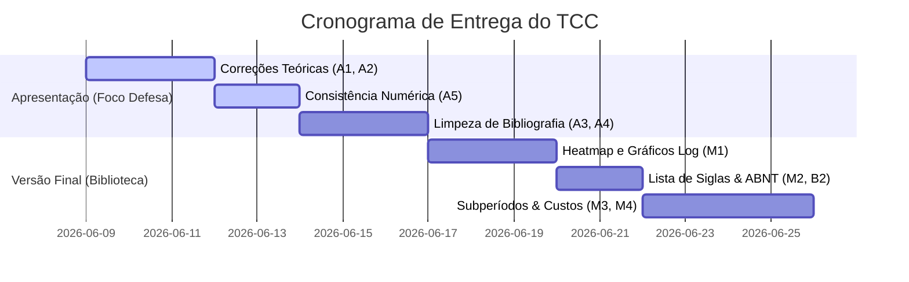

# Plano de Ação e Síntese de Auditoria (Fase P7)

Este documento consolida as conclusões dos relatórios de auditoria de código, testes, texto, referências, rastreabilidade teórica e recomendações A1 para o TCC da Universidade Federal de Goiás (UFG). Apresenta-se a seguir um **backlog único priorizado** de intervenções com foco no prazo crítico do dia **29 de junho**.

---

## 1. Backlog Único Priorizado

As ações necessárias estão agrupadas por severidade e ordenadas por relação (Impacto na Avaliação) / (Esforço de Implementação):

### 1.1. ALTA PRIORIDADE (Crítico para a Integridade Acadêmica)

| ID | Tarefa / Ação | Tipo | Racional | Esforço | Impacto |
| :--- | :--- | :--- | :--- | :--- | :--- |
| **A1** | **Correção de Sharpe vs. Utilidade** | Texto | Eliminar a afirmação incorreta de que a estratégia `MaxSharpe` resolve um problema quadrático médio-variância com $\delta=3.0$ devido à não-convexidade. Alinhar o texto da metodologia (`P1107-1108`) com a implementação exata de maximização direta do Sharpe via SLSQP. | Baixo | **Crítico** |
| **A2** | **Declaração de Simplificação de $\Sigma_{BL}$** | Texto | Incluir nota na seção de Black-Litterman (`P1189`) admitindo que a covariância a posteriori $\Sigma_{BL}$ foi omitida no otimizador para estabilizar as matrizes e evitar soluções degeneradas sob o momentum transversal, utilizando-se em seu lugar a covariância a priori ($S_{anual}$ / $SigD$). | Baixo | **Crítico** |
| **A3** | **Limpeza da Bibliografia ABNT** | Texto | Corrigir as 4 anomalias severas na lista de referências do Word: (1) desfazer a fusão física Meucci/Morgan (`P1432`); (2) remover comentário interno do orientador em Rockafellar (`P1449`); (3) remover call number de Damodaran (`P1387`); (4) excluir duplicidade de Lund University (`P1424`/`P1476`). | Baixo | **Crítico** |
| **A4** | **Reconciliação de Órfãs e Fantasmas** | Texto | Adicionar as referências para as 21 citações órfãs (CAPM, Scholes, Iglewicz-Hoaglin, Best-Grauer, Satchell-Scowcroft). Remover da bibliografia as 22 referências fantasmas de modelos GARCH/LSTM que não fazem parte do escopo final do pipeline. | Médio | **Alto** |
| **A5** | **Consistência Numérica Texto ↔ Tabelas** | Texto | Atualizar na prosa todos os números divergentes das Tabelas correspondentes: ajustar o Sharpe de `MinVar` de 0,217 para 0,293; corrigir o CAGR de `MinCDaR` de -1,75% para +5,36% (drawdown de -81,8% para -62,4%); e remover a afirmação de que a carteira 1/N está "entre as piores" (uma vez que performa como mediana-superior). | Baixo | **Crítico** |
| **A6** | **Nota sobre o Prior 1/N do Black-Litterman** *(achado B1, auditoria de 03/06)* | Texto | O código usa `wm = 1/N` como proxy do portfólio de mercado no prior de equilíbrio do BL, por indisponibilidade de dados de capitalização para o histórico completo. Incluir nota de rodapé na metodologia admitindo a aproximação (e remover qualquer menção a "capitalização de mercado") — ou providenciar os dados de market cap e re-executar NB07/NB09. | Baixo (nota) / Alto (re-execução) | **Crítico** |
| **A7** | **Declarar Constant-Mix vs. Buy-and-Hold** *(achado A1, auditoria de 03/06)* | Texto | A implementação do backtest mantém pesos fixos diariamente entre rebalanceamentos (constant-mix), e não buy-and-hold com deriva intramês — apenas `EqualWeight_BuyHold` deriva livremente. Declarar explicitamente no Capítulo 3.5 para blindar a metodologia contra questionamento da banca. | Baixo | **Alto** |

### 1.2. MÉDIA PRIORIDADE (Aprimoramento Científico e Qualidade Visual)

| ID | Tarefa / Ação | Tipo | Racional | Esforço | Impacto |
| :--- | :--- | :--- | :--- | :--- | :--- |
| **M1** | **Heatmap de Pesos e Riqueza Log** | Visual | Gerar e inserir no TCC as figuras essenciais recomendadas em `RELATORIO_A1.md`: gráfico de riqueza acumulada em escala logarítmica e o heatmap de pesos históricos para ilustrar o teto de 10% (CVM 175) e a esparsidade das carteiras. | Baixo | **Alto** |
| **M2** | **Lista de Abreviaturas** | Estrutura | Inserir a seção preliminar de abreviaturas e siglas compiladas do texto (conforme item 2 do `RELATORIO_A1.md`), garantindo que todos os termos (MPT, PMPT, GARCH, MAD, etc.) estejam catalogados. | Baixo | **Médio** |
| **M3** | **Análise por Subperíodos** | Robustez | Adicionar tabela resumindo a performance ajustada (Sharpe/CAGR) sob as três subamostras temporais (2015-18, 2019-22 e 2023-25), enriquecendo o capítulo de resultados. | Médio | **Alto** |
| **M4** | **Sensibilidade a Custos de Transação** | Robustez | Executar o pipeline de backtest sob custos de transação de 0 bps e 100 bps (além dos 50 bps oficiais), inserindo tabela comparativa para desarmar a crítica de turnover excessivo do modelo BL. | Médio | **Médio** |
| **M5** | **Explicação do SE Bootstrap na Seção 4.3** *(achado C2, auditoria de 03/06)* | Texto | Explicar por que o ΔSR maior do `MinVar` (+0,294) não é significativo enquanto o ΔSR menor do `InvVol` (+0,145) é: o fator determinante é o erro-padrão bootstrap (InvVol tem correlação estável com EW → SE ≈ 0,0014; MinVar tem composição variável → SE ≈ 0,0092). Resultado contraintuitivo que será questionado pela banca se não for destacado. | Baixo | **Alto** |

### 1.3. BAIXA PRIORIDADE (Extensões Acadêmicas e Detalhes)

| ID | Tarefa / Ação | Tipo | Racional | Esforço | Impacto |
| :--- | :--- | :--- | :--- | :--- | :--- |
| **B1** | **Discussão do Deflated Sharpe Ratio** | Texto | Citar o DSR (Bailey & López de Prado) na seção de limitações para comprovar consciência acadêmica de data-snooping diante do teste simultâneo de 16 estratégias. | Baixo | **Médio** |
| **B2** | **Padronização de Citações ABNT** | Texto | Corrigir a grafia de autoria múltipla dentro de parênteses substituindo vírgulas `,` por ponto e vírgula `;` (ex.: `P911`) e padronizar o uso de caixa alta/baixa fora de parênteses. | Médio | **Baixo** |
| **B3** | **Assert de Alinhamento IBOV/CDI no NB09** *(achado G4, auditoria de 03/06)* | Código | Adicionar no NB09 a guarda `assert df[["ret_ibov", "rf"]].isna().sum().sum() == 0, "Datas desalinhadas!"` após o merge das séries, prevenindo silenciosamente NaNs em caso de desalinhamento de calendários. Re-validar com `revalidar.py` após a mudança. | Baixo | **Baixo** |
| **B4** | **Centralizar Parâmetros do NB09 no `config.json`** *(achado G6, auditoria de 03/06 — parcialmente resolvido)* | Código | A nomenclatura `BOOT_REPS` foi unificada para `BOOTSTRAP_REPS`, porém `SEED = 42`, `BOOTSTRAP_REPS = 2000` e `BOOTSTRAP_BLOCK_MEAN = 10` continuam hardcoded na célula de configuração do NB09 em vez de carregados via `cfg.get(...)` do `config.json` (que já define `BOOTSTRAP_REPS`). Alinhar com a diretriz de parâmetros centralizados do CLAUDE.md. Re-validar com `revalidar.py` após a mudança. | Baixo | **Baixo** |

---

## 2. Caminho Crítico (Defesa vs. Versão Final da Biblioteca)

Para otimizar o tempo disponível até a data limite, o plano de ação é dividido em dois marcos temporais:

### 2.1. Inclusão Obrigatória para a Defesa (Caminho Crítico)
*   **A1 e A2 (Fidelidade Teórica):** Devem ser alterados imediatamente no Word para evitar que a banca examine o código e aponte contradição nos otimizadores e no uso de $\Sigma_{BL}$.
*   **A5 (Consistência Numérica):** Os dados da prosa devem coincidir rigorosamente com os slides e tabelas do documento para que o discurso do autor seja coeso.
*   **A3 (Erros de Referência Visíveis):** A presença física da "Nota do Orientador" e a fusão de linhas Meucci/Morgan causam péssima impressão formal e devem ser resolvidas.
*   **A6 e A7 (Fidelidade Metodológica — auditoria de 03/06):** A nota sobre o prior 1/N do Black-Litterman e a declaração de constant-mix são classificadas como obrigatórias antes da defesa pelo relatório `03_relatorio_final.md`, pois descrevem o que o código efetivamente faz.

### 2.2. Implementável na Versão Final (Pós-Defesa)
*   As simulações estatísticas adicionais (subperíodos, custos transacionais alternativos).
*   A formatação de siglas e padronização fina de pontuação de citações ABNT.
*   O heatmap gráfico de pesos transversal de ativos.

---

## 3. Dependências e Fluxo de Trabalho

Toda alteração de código ou de texto deve seguir o grafo de dependências estabelecido para evitar a propagação de inconsistências:

1.  **Modificações no Pipeline (se houver):**
    `Modificação de Código (src/)` $\to$ `Execução de revalidar.py` $\to$ `Validação contra golden_master.json (tolerância < 1e-6)`.
2.  **Modificações de Tabelas e Resultados:**
    `Atualização de Dados (results/)` $\to$ `Geração de Tabelas Textuais` $\to$ `Escrita no .docx final`.
3.  **Atualização da Prosa:**
    `Leitura dos Dados Finais` $\to$ `Ajuste da Prosa do Capítulo 4` $\to$ `Higiene da Bibliografia`.

---

## 4. Riscos e Portões de Segurança (Gates)

> [!CAUTION]
> **Portão de Segurança Obrigatório (Branch `tcc-aprimoramento`):**
> Nenhuma modificação nos scripts quantitativos sob `src/` ou `utils/` poderá ser integrada à branch sem que a suíte de testes rápida (`pytest -m "not slow"`) retorne verde e o script `revalidar.py` reporte **PASS** para todas as métricas contra o `golden_master.json`. Isso previne a destruição involuntária da integridade numérica da dissertação.

---

## 5. Adendo — Recalibração do Gate de Re-validação (10/06/2026)

Este plano foi atualizado após revisão independente da auditoria, com as seguintes mudanças:

1.  **Tolerância do `revalidar.py` corrigida de `rtol=1e-5` para `rtol=1e-6`**, alinhando o código ao invariante declarado no `CLAUDE.md` e no `00_setup.md` (que afirmavam 1e-6, mas o script aplicava 1e-5).
2.  **Checagem de hashes MD5 do universo adicionada ao `revalidar.py`**: a seção `universe_hashes` do `golden_master.json` (proteção contra alteração do universo de 102 ativos) existia mas nunca era verificada pelo script. Agora os três CSVs (`universo_pos_liquidez.csv`, `tickers_finais.csv`, `tickers_excluidos_integridade.csv`) são validados a cada execução.
3.  **Re-baseline pontual do `golden_master.json` (MaxSharpe e MaxSharpe_c10):** a tolerância estrita expôs que o snapshot original divergia dos outputs atuais em ~1e-6 a 8e-6 relativo nessas duas estratégias (ruído de solver decorrente da re-execução do NB07 após a introdução dos gradientes analíticos no commit `1684c82`). As entradas foram atualizadas para os valores atuais de `desempenho_estrategias.csv` em precisão completa. **Sem impacto textual:** ambas as versões arredondam para os mesmos valores publicados nas Tabelas 8/9 do TCC (Sharpe 0,305 e 0,261). Os valores antigos permanecem no histórico do git.
4.  **Backlog ampliado com as pendências órfãs da auditoria de 03/06** (`03_relatorio_final.md`), que não haviam sido incorporadas na consolidação P7: itens **A6** (prior 1/N do BL — achado B1), **A7** (constant-mix — achado A1), **M5** (SE bootstrap — achado C2), **B3** (assert de alinhamento — achado G4) e **B4** (parâmetros centralizados no NB09 — achado G6 parcial).

Após as mudanças, `revalidar.py --check-only` reporta **PASS integral** (17 séries de métricas, 8 shapes e 3 hashes) e a suíte rápida do pytest segue verde (92 passed).
