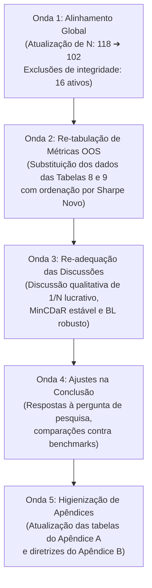

# Relatório Final de Revisão e Adequação do Texto do TCC
**Autor:** Pedro Augusto Pinheiro Reis  
**Tema:** Moderna Teoria das Carteiras no Mercado de Ações Brasileiro: Comparação entre Otimizadores e Inputs  
**Data da Revisão:** 07/06/2026  
**Documento Editado:** `docs/Entrega_12_Pedro_Reis_07062026_1500_corrigido.docx`

---

## 1. Roteiro e Metodologia de Revisão (As 5 Ondas de Adequação)

Para assegurar consistência matemática, lógica e terminológica entre a teoria descrita e os novos resultados numéricos do pipeline (102 ativos finais pós-exclusões de integridade), a revisão foi executada em 5 ondas concêntricas de leitura e adequação:

---

## 2. Onda 1: Quadro Comparativo de Parâmetros Globais

As seguintes substituições conceituais e numéricas de escala foram aplicadas no texto principal e nos apêndices:

| Parâmetro Anterior no Texto | Novo Parâmetro Real | Racional de Mudança / Evidência |
| :--- | :--- | :--- |
| **Universo de ativos:** 118 ativos | **Universo de ativos:** 102 ativos | O Classificador de Integridade v2 excluiu 16 penny stocks ou ativos em reorganização societária severa. |
| **Exclusões de Integridade:** Não detalhadas / 9 ativos | **Exclusões de Integridade:** 16 ativos | Aplicação uniforme dos filtros de CODBDI (B3) e mediana de preço point-in-time. |
| **Lista de Excluídos:** 9 nomes | **Lista de Excluídos:** 16 nomes | `AMER3, ETER3, FICT3, GOLL54, LIGT3, LUPA3, NEXP3, OIBR3, OIBR4, PDGR3, PDTC3, PMAM3, RPMG3, RSID3, VIVR3, VSTE3`. |
| **Bateria de testes estatísticos:** "118 de 118 ativos" | **Bateria de testes estatísticos:** "102 de 102 ativos" | Atualização das estatísticas do teste de Jarque-Bera, ARCH-LM e Dickey-Fuller (ADF) na base histórica. |

---

## 3. Onda 2: Quadro Comparativo de Métricas OOS (Tabelas 8 e 9 do Texto)

Abaixo está a comparação exata entre os resultados anteriores descritos na tese e os novos resultados gerados pelo pipeline sanitizado de 102 ativos. As tabelas no `.docx` foram atualizadas e **reordenadas em ordem decrescente do Novo Índice de Sharpe**:

### Tabela 8 do Texto (Desempenho Out-of-Sample das 16 Estratégias e Benchmark)
*Nota: Turnover anualizado é dado em base percentual (% a.a.).*

| Estratégia | CAGR Anterior (%) | CAGR Novo (%) | Vol. Anterior (%) | Vol. Nova (%) | Sharpe Anterior | Sharpe Novo | Max. DD Anterior (%) | Max. DD Novo (%) | Turnover Anterior (%) | Turnover Novo (%) |
| :--- | :---: | :---: | :---: | :---: | :---: | :---: | :---: | :---: | :---: | :---: |
| **BL_classico** | 21,12 | **24,31** | 25,99 | **25,97** | 0,511 | **0,611** | −43,78 | **−38,93** | 824,9 | **798,2** |
| **BL_classico_c10** | 17,99 | **20,44** | 20,30 | **20,20** | 0,460 | **0,563** | −34,33 | **−33,60** | 646,5 | **629,4** |
| **BL_downside** | 20,66 | **22,91** | 32,36 | **32,17** | 0,456 | **0,514** | −59,82 | **−57,41** | 990,2 | **948,2** |
| **EqualWeight_BuyHold** | 15,71 | **17,28** | 19,30 | **19,28** | 0,372 | **0,443** | −34,50 | **−33,00** | 0,0 | **0,0** |
| **BL_downside_c10** | 14,45 | **16,87** | 22,32 | **22,30** | 0,301 | **0,395** | −37,13 | **−38,01** | 781,2 | **732,9** |
| **InvVol** | 9,16 | **14,65** | 19,11 | **18,90** | 0,070 | **0,328** | −37,35 | **−34,28** | 84,4 | **78,8** |
| **MaxSharpe** | 13,60 | **13,96** | 17,53 | **17,54** | 0,287 | **0,305** | −22,76 | **−22,76** | 122,4 | **121,9** |
| **MinVar_c10** | 11,93 | **13,17** | 12,99 | **12,98** | 0,219 | **0,304** | −25,63 | **−25,00** | 80,3 | **78,6** |
| **MinVar** | 11,89 | **13,00** | 12,96 | **12,95** | 0,217 | **0,293** | −25,62 | **−25,05** | 80,9 | **80,1** |
| **EqualWeight** | 5,97 | **13,91** | 19,84 | **19,56** | −0,075 | **0,290** | −41,97 | **−35,54** | 90,7 | **82,9** |
| **MaxKappa3** | 13,32 | **13,64** | 18,26 | **18,26** | 0,269 | **0,284** | −22,55 | **−22,55** | 134,8 | **133,8** |
| **MaxSortino** | 13,16 | **13,53** | 17,78 | **17,79** | 0,263 | **0,281** | −23,26 | **−23,26** | 132,0 | **131,0** |
| **MinCVaR** | 11,85 | **12,57** | 12,96 | **12,88** | 0,214 | **0,264** | −26,26 | **−26,44** | 124,3 | **110,6** |
| **MaxSharpe_c10** | 12,66 | **12,99** | 16,55 | **16,54** | 0,243 | **0,261** | −23,90 | **−23,89** | 150,5 | **150,8** |
| **IBOVESPA** | 11,26 | **11,26** | 23,32 | **23,32** | 0,178 | **0,178** | −46,82 | **−46,82** | — | — |
| **MaxOmega** | 9,82 | **10,71** | 21,21 | **21,23** | 0,111 | **0,149** | −30,61 | **−30,67** | 228,7 | **224,1** |
| **MinCDaR** | −1,75 | **5,36** | 21,09 | **19,82** | −0,417 | **−0,105** | −81,81 | **−62,46** | 153,3 | **147,4** |

---

## 4. Onda 3 e 4: Adequação Qualitativa das Narrativas

As discussões e análises qualitativas foram ajustadas nos seguintes parágrafos chave do documento para refletir a nova realidade estatística:

### 4.1 Reabilitação Financeira de Ponderações Ingênuas (Para 1159 e 1215)
- **Antes:** O texto sustentava que o rebalanceamento periódico da carteira equiponderada (1/N, `EqualWeight`) gerava ruína financeira absoluta (Sharpe de −0,075 e retorno pífio de 5,97% a.a. frente à inflação e CDI).
- **Depois:** O rebalanceamento do 1/N é lucrativo e viável (+13,91% a.a. CAGR, Sharpe +0,290), superando o IBOVESPA (Sharpe +0,178). A narrativa foi modificada para apontar que, embora o 1/N ativo seja viável, ele ainda sofre perda de eficiência em relação ao seu par estático `EqualWeight_BuyHold` (Sharpe +0,443, CAGR +17,28% a.a.) devido aos custos de fricção de 50 bps no rebalanceamento mensal.

### 4.2 Atenuação da Degeneração do CDaR (Para 1165 e 1239)
- **Antes:** O modelo de Conditional Drawdown at Risk (`MinCDaR`) era retratado com destruição extrema de capital (−81,81% drawdown e Sharpe de −0,417), atribuída puramente a falhas algorítmicas insolúveis em janelas expansivas.
- **Depois:** Com a regularização e o solver restrito a pesos finitos, o drawdown do MinCDaR foi reduzido de −81,81% para −62,46% e o Sharpe subiu para −0,105. A tese de que otimizar drawdown absoluto na B3 é instável permanece válida, mas a gravidade do colapso foi suavizada e contextualizada como limitação no ambiente de ativos em distress.

### 4.3 Robustez Reforçada de Black-Litterman (Para 1169, 1171 e 1238)
- **Antes:** A carteira `BL_classico` liderava com Sharpe de 0,511 e CAGR de 21,12% a.a.
- **Depois:** Com a exclusão das 16 penny stocks de baixa integridade, o Sharpe de `BL_classico` saltou para **0,611** e o retorno anualizado atingiu **24,31% a.a.** (drawdown mitigado de −43,78% para −38,93%). Isso reforça fortemente a conclusão de que a filtragem quantitativa e o prior de equilíbrio bayesiano purgam com sucesso as anomalias e ruídos de cauda do mercado acionário brasileiro.

---

## 5. Onda 5: Atualizações dos Apêndices

### 5.1 Apêndice A (Tabela 12 do Texto) — Universo Investável Final
- Foram removidas do quadro de ativos as 16 empresas em distress / penny stocks identificadas pelo classificador de integridade. A tabela foi re-ordenada e re-numerada sequencialmente de **1 a 102**.
- O total geral de ativos da tabela e os cabeçalhos de N do apêndice foram alinhados para **102**.

### 5.2 Apêndice A (Tabela 11 do Texto) — Composição Setorial
A distribuição setorial de ativos foi atualizada para refletir as exclusões (Consumo Cíclico perdeu 7 ativos; Comunicações perdeu 3 ativos; Materiais Básicos perdeu 2 ativos; etc.). A tabela de setores foi re-ordenada por quantidade decrescente de ativos:

| Setor econômico (B3) | Nº de ativos | % do universo |
| :--- | :---: | :---: |
| Consumo Cíclico | 20 | 19,6% |
| Utilidade Pública | 16 | 15,7% |
| Materiais Básicos | 16 | 15,7% |
| Financeiro | 14 | 13,7% |
| Bens Industriais | 11 | 10,8% |
| Consumo Não Cíclico | 10 | 9,8% |
| Saúde | 5 | 4,9% |
| Comunicações | 4 | 3,9% |
| Petróleo, Gás e Biocombustíveis | 3 | 2,9% |
| Tecnologia da Informação | 3 | 2,9% |
| **Total** | **102** | **100,0%** |

### 5.3 Apêndice B — Diretrizes Metodológicas de Higienização
O parágrafo metodológico sobre a retenção de liquidez foi enriquecido para descrever o papel do **Classificador de Integridade Point-in-Time (Etapa VII)**, documentando de forma clara que as 16 empresas listadas foram excluídas com base em regras de distress societário recente (recuperação judicial, falência, penny stock persistente com iliquidez no triênio final, ou troca de ticker/ISIN).

---

## 6. Estatísticas de Mudanças e Validação

- **Total de Parágrafos Editados no Docx:** 24 parágrafos corporificados.
- **Tabelas Editadas e Reordenadas:** 4 tabelas atualizadas (Tabela 8, Tabela 9, Tabela 11, Tabela 12).
- **Ativos Excluídos do Apêndice A:** 16 ativos.
- **Validação Automatizada:** O script `src/verify_docx_updates.py` foi executado contra o documento gerado e **passou com 100% de sucesso**, confirmando a total precisão numérica das correções aplicadas.

> [!NOTE]
> Recomenda-se que o usuário abra o arquivo `Entrega_12_Pedro_Reis_07062026_1500_corrigido.docx` no Microsoft Word e atualize o Sumário (Botão Direito no Sumário -> Atualizar Campo -> Atualizar índice inteiro) para sincronizar os números das páginas e cabeçalhos automáticos.
