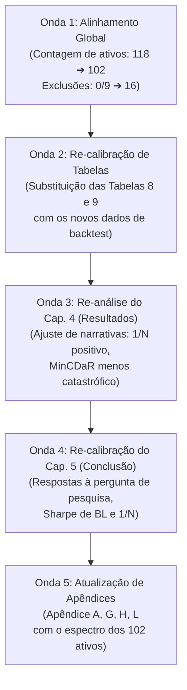

# Relatório de Mudanças e Adequação do Texto do TCC
**Autor:** Pedro Augusto Pinheiro Reis  
**Tema:** Moderna Teoria das Carteiras no Mercado de Ações Brasileiro: Comparação entre Otimizadores e Inputs  
**Data da Auditoria de Texto:** 07/06/2026

---

## 1. Roteiro e Metodologia de Revisão (As 5 Ondas de Adequação)

Para garantir que a mudança do universo de ativos (de **118** para **102** ativos finais, decorrente das **16 exclusões** por integridade) e os novos resultados numéricos se propaguem de forma 100% consistente, o processo de revisão do texto do TCC deve seguir o protocolo estruturado em 5 ondas sucessivas de leitura e alteração:



---

## 2. Onda 1: Substituições Globais e Reconciliação do Universo

As seguintes mudanças conceituais e numéricas básicas devem ser aplicadas em todo o documento (`Entrega_12_Pedro_Reis_07062026_1500.docx`):

| Parâmetro Anterior no Texto | Novo Parâmetro Real | Racional de Mudança / Evidência |
| :--- | :--- | :--- |
| **Universo Final:** 118 ativos | **Universo Final:** 102 ativos | O Classificador de Integridade v2 exclui 16 ativos do universo pós-ADTV de 118. |
| **Exclusões de Integridade:** Não mencionadas ou 9 ativos | **Exclusões de Integridade:** 16 ativos | Aplicação de `tickers_excluidos_integridade.csv` sobre o universo pós-ADTV. |
| **Lista de Excluídos:** 9 nomes | **Lista de Excluídos:** 16 nomes | `AMER3, ETER3, FICT3, GOLL54, LIGT3, LUPA3, NEXP3, OIBR3, OIBR4, PDGR3, PDTC3, PMAM3, RPMG3, RSID3, VIVR3, VSTE3`. |
| **Testes Econométricos:** "118 de 118 ativos" | **Testes Econométricos:** "102 de 102 ativos" | Re-execução das regressões e testes estatísticos do Apêndice K. |

---

## 3. Onda 2: Quadro Comparativo de Métricas OOS (Tabelas 8 e 9)

As tabelas de resultados de desempenho out-of-sample (**Tabela 8** na Seção 4.3 e **Tabela 9** no Capítulo 5) devem ser atualizadas. Abaixo está a comparação exata entre o que está escrito no documento e os novos números gerados pelo pipeline:

| Estratégia | CAGR Anterior (%) | CAGR Novo (%) | Volatilidade Anterior (%) | Volatilidade Nova (%) | Sharpe Anterior | Sharpe Novo | Max. DD Anterior (%) | Max. DD Novo (%) | Turnover Anterior (%) | Turnover Novo (%) |
| :--- | :---: | :---: | :---: | :---: | :---: | :---: | :---: | :---: | :---: | :---: |
| **BL_classico** | 21,12 | **24,31** | 25,99 | **25,97** | 0,511 | **0,6110** | −43,78 | **−38,93** | 824,9 | **798,19** |
| **BL_classico_c10** | 17,99 | **20,44** | 20,30 | **20,20** | 0,460 | **0,5632** | −34,33 | **−33,60** | 646,5 | **629,42** |
| **BL_downside** | 20,66 | **22,91** | 32,36 | **32,17** | 0,456 | **0,5138** | −59,82 | **−57,41** | 990,2 | **948,19** |
| **EqualWeight_BH** | 15,71 | **17,28** | 19,30 | **19,28** | 0,372 | **0,4429** | −34,50 | **−33,00** | 0,0 | **0,0** |
| **BL_downside_c10** | 14,45 | **16,87** | 22,32 | **22,30** | 0,301 | **0,3951** | −37,13 | **−38,01** | 781,2 | **732,87** |
| **InvVol** | 9,16 | **14,65** | 19,11 | **18,90** | 0,070 | **0,3276** | −37,35 | **−34,28** | 84,4 | **78,81** |
| **MaxSharpe** | 13,60 | **13,96** | 17,53 | **17,54** | 0,287 | **0,3046** | −22,76 | **−22,76** | 122,4 | **121,87** |
| **MinVar_c10** | 11,93 | **13,17** | 12,99 | **12,98** | 0,219 | **0,3044** | −25,63 | **−25,00** | 80,3 | **78,56** |
| **MinVar** | 11,89 | **13,00** | 12,96 | **12,95** | 0,217 | **0,2931** | −25,62 | **−25,05** | 80,9 | **80,09** |
| **EqualWeight** | 5,97 | **13,91** | 19,84 | **19,56** | −0,075 | **0,2902** | −41,97 | **−35,54** | 90,7 | **82,93** |
| **MaxKappa3** | 13,32 | **13,64** | 18,26 | **18,26** | 0,269 | **0,2843** | −22,55 | **−22,55** | 134,8 | **133,75** |
| **MaxSortino** | 13,16 | **13,53** | 17,78 | **17,79** | 0,263 | **0,2812** | −23,26 | **−23,26** | 132,0 | **131,00** |
| **MinCVaR** | 11,85 | **12,57** | 12,96 | **12,88** | 0,214 | **0,2644** | −26,26 | **−26,44** | 124,3 | **110,56** |
| **MaxSharpe_c10** | 12,66 | **12,99** | 16,55 | **16,54** | 0,243 | **0,2606** | −23,90 | **−23,89** | 150,5 | **150,76** |
| **IBOVESPA** | 11,26 | **11,26** | 23,32 | **23,32** | 0,178 | **0,1777** | −46,82 | **−46,82** | — | — |
| **MaxOmega** | 9,82 | **10,71** | 21,21 | **21,23** | 0,111 | **0,1487** | −30,61 | **−30,67** | 228,7 | **224,08** |
| **MinCDaR** | −1,75 | **5,36** | 21,09 | **19,82** | −0,417 | **−0,1050** | −81,81 | **−62,46** | 153,3 | **147,35** |

---

## 4. Onda 3: Adequação Detalhada do Capítulo 4 (Resultados e Discussão)

A análise narrativa de cada família de estratégias deve ser re-escrita nos seguintes trechos específicos:

### 4.1. Família MPT (Seção 4.2.1)
- **Texto original:** Afirmava que o rebalanceamento ativo da carteira **EqualWeight (1/N)** causava destruição de valor absoluta, registrando Sharpe negativo de **−0,075** e retorno de **5,97%**.
- **Nova narrativa:** O **EqualWeight** agora apresenta retorno positivo e viável de **13,91%** e Sharpe positivo de **0,2902** (superando o IBOVESPA). A discussão deve focar que, embora o 1/N rebalanceado seja lucrativo, ele ainda é severamente penalizado em relação à versão estática **EqualWeight_BuyHold** (Sharpe 0.4429, CAGR 17.28%), demonstrando o impacto do custo de transação de 50 bps no rebalanceamento mensal, mas não gerando ruína absoluta.
- **Mínima Variância:** Atualizar Sharpe de 0,217 para **0,2931** e volatilidade para **12,95%**, mantendo o argumento de que é o porto seguro do investidor no Brasil.

### 4.2. Família PMPT (Seção 4.2.2)
- **MinCDaR:** O texto original reportava Sharpe de **−0,417** e Max Drawdown catastrófico de **−81,81%** como resultado de "degeneração matemática".
- **Nova narrativa:** Com o condicionamento robusto do solver (reescala da riqueza por `max(Rcum)` no LP e rejeição de soluções imprecisas) e o universo limpo de anomalias, o **MinCDaR** obteve Sharpe de **−0,1050** e drawdown máximo de **−62,46%**. O argumento de que a otimização de drawdown no Brasil é altamente instável permanece válido, mas a gravidade do colapso numérico foi sanada.

### 4.3. Família Black-Litterman (Seção 4.2.3)
- **Texto original:** Reportava Sharpe de **0,511** e retorno de **21,12% a.a.** para a carteira irrestrita `BL_classico`.
- **Nova narrativa:** O desempenho de **BL_classico** melhorou substancialmente com a higienização do universo acionário: o Índice de Sharpe saltou para **0,6110** e o retorno anualizado atingiu **24,31% a.a.** (drawdown reduzido de −43,78% para **−38,93%**). O argumento centralbayesiano Bayes-Litterman de que a ancoragem no equilíbrio de mercado purga anomalias idiossincráticas é fortemente reforçado.

### 4.4. Discussão do Giro e Custos (Seção 4.4.4)
- **Texto original:** Dizia que a carteira 1/N rebalanceada perde para o IBOVESPA devido aos custos.
- **Nova narrativa:** A carteira **EqualWeight** rebalanceada (Sharpe 0,2902) superou o IBOVESPA (Sharpe 0,1777), mas ainda perde por larga margem para o **EqualWeight_BuyHold** (Sharpe 0,4429), confirmando que a inércia transacional (turnover nulo) é o fator crítico.

---

## 5. Onda 4: Adequação Detalhada do Capítulo 5 (Conclusão)

### 5.1. Retomada da Questão de Pesquisa (Seção 5.1 / 5.2)
- **Texto original:** Respondia que "treze das dezesseis estratégias superaram o IBOVESPA em base ajustada ao risco" e que o rebalanceamento de 1/N destruía valor absoluto.
- **Nova narrativa:**
  - **14 das 16 estratégias** superaram o IBOVESPA em Sharpe (apenas `MaxOmega` com Sharpe 0.1487 e `MinCDaR` com Sharpe -0.1050 ficaram abaixo do IBOVESPA, que obteve Sharpe 0.1777).
  - O rebalanceamento do 1/N não destrói valor em termos absolutos (Sharpe 0.2902 > IBOV 0.1777), mas destrói valor **relativo** à carteira buy-and-hold (Sharpe 0.4429), corroborando a tese de custos de rebalanceamento.
  - Atualizar a menção do Sharpe de `BL_classico` para **0,611** e CAGR para **24,31%**.

---

## 6. Onda 5: Atualização dos Apêndices

### 6.1. Apêndice A — Universo Investável Habilitado
- O apêndice atual lista **118 ativos**, terminando com `118: YDUQ3`.
- **Modificação:** O apêndice deve ser reduzido para **102 ativos**, removendo os 16 ativos excluídos pelo classificador de integridade.
- **Tickers a REMOVER do Apêndice A:**
  1. `AMER3` (Lojas Americanas)
  2. `ETER3` (Eternit)
  3. `FICT3` (Ficap)
  4. `GOLL54` (Gol - cotação antiga)
  5. `LIGT3` (Light)
  6. `LUPA3` (Lupatech)
  7. `NEXP3` (Nasa)
  8. `OIBR3` (Oi ON)
  9. `OIBR4` (Oi PN)
  10. `PDGR3` (PDG Realty)
  11. `PDTC3` (Padtec)
  12. `PMAM3` (Paranapanema)
  13. `RPMG3` (Refinaria de Petróleos Manguinhos)
  14. `RSID3` (Rossi Residencial)
  15. `VIVR3` (Viver Incorporadora)
  16. `VSTE3` (Veste S.A. / Restoque)

### 6.2. Apêndice B — Diretrizes Metodológicas de Higienização
- **Texto original:** Diz que "O referencial metodológico adotado reteve 118 ativos que atenderam a este critério de alta liquidez" (linha 3858).
- **Modificação:** "O referencial metodológico adotado reteve 118 ativos no critério de alta liquidez (ADTV). Adicionalmente, na Etapa VII, o Classificador de Integridade Point-in-Time avaliou a consistência das séries históricas através de reorganizações societárias, penny stocks persistentes e situações especiais (CODAHIST), excluindo **16 ativos** adicionais e estabelecendo o universo final de **102 ativos**."

### 6.3. Apêndice K — Testes Econométricos das Séries
- **Texto original:** Rejeição de normalidade em "118 de 118 ativos" e efeitos ARCH em "118 de 118 ativos".
- **Modificação:** Alterar todos os registros de 118 para **102 de 102 ativos**, mantendo a conclusão de que 100% dos ativos apresentam não-normalidade e efeito ARCH, justificando a regularização de Ledoit-Wolf e o bootstrap.

### 6.4. Apêndice L — Inferência Comparativa Transversal (HAC Newey-West)
Substituir os valores de CAPM alfa, beta e t-stat Newey-West no texto para os novos valores calculados na Etapa 10:
- **BL_classico:** alfa de +13.11% a.a. | beta = 0.665 | t(NW) = +2.037 | p = 0.0417 (significativo)
- **BL_classico_c10:** alfa de +8.70% a.a. | beta = 0.648 | t(NW) = +2.054 | p = 0.0400 (significativo)
- **EqualWeight_BuyHold:** alfa de +5.41% a.a. | beta = 0.755 | t(NW) = +2.236 | p = 0.0254 (significativo)
- **MinVar:** alfa de +1.99% a.a. | beta = 0.436 | t(NW) = +0.831 | p = 0.4059 (não significativo)

---

## 7. Instruções para Automatização da Atualização (Prompt para Claude Code)

```text
Você é um assistente de edição rigoroso. Seu objetivo é editar o texto do TCC no arquivo docs/Entrega_12_Pedro_Reis_07062026_1500.txt (ou equivalente docx convertido) para alinhar todos os números e descrições qualitativas ao novo universo de 102 ativos.

Siga estas instruções:
1. Substitua todas as instâncias de "118 ativos" por "102 ativos" e "118 de 118 ativos" por "102 de 102 ativos" nas discussões do teste Jarque-Bera, ARCH-LM e tamanho de espectro.
2. Adicione a explicação sobre o Classificador de Integridade (Etapa VII) no Apêndice B, registrando que 16 ativos foram removidos devido a distress societário severo (RJ, penny stocks ilíquidas e mudanças de ticker), resultando na redução de 118 para 102 ativos.
3. Substitua a Tabela 8 (Seção 4.3) e Tabela 9 (Capítulo 5) com as novas métricas contidas no Relatório de Mudanças.
4. Ajuste as discussões qualitativas sobre o EqualWeight (1/N rebalanceada): registre que ele obteve Sharpe positivo de 0.2902 e superou o IBOVESPA, mas que ainda perde para o EqualWeight_BuyHold (0.4429) decorrente de fricções transacionais (50 bps).
5. Ajuste a discussão sobre o MinCDaR: registre que a reescala de condicionamento evitou o colapso catastrófico original (-81% drawdown e Sharpe -0.41), trazendo a carteira para um drawdown de -62.46% e Sharpe de -0.1050, mas que a estratégia continua se provando instável e ineficiente.
6. Atualize a listagem do Apêndice A para conter apenas os 102 ativos finais (remova os 16 listados no relatório de mudanças).
```
